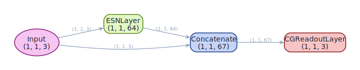

<span class="nb-kicker">Build · Architecture</span>

# classic_esn

The standard Echo State Network baseline. In this implementation the readout
sees the raw input concatenated with the reservoir states, not the states
alone.

## Wiring

`Input → Reservoir → Concatenate(Input, States) → Readout`

The feedback signal drives a tanh reservoir, then rejoins its own states at
the concatenation, so the readout (a
[`CGReadoutLayer`](../readouts/cg-readout.md)) solves ridge regression over
`feedback_size + reservoir_size` features. The linear part of the
input–output map reaches the readout unfiltered; the reservoir only has to
supply what linearity cannot.

<figure markdown>

<figcaption>Model graph: the input feeds both the reservoir and the concatenation.</figcaption>
</figure>

## Use

```python
import torch
from resdag.models import classic_esn
from resdag.training import ESNTrainer

series = torch.cumsum(0.1 * torch.randn(1, 1201, 3), dim=1)

model = classic_esn(reservoir_size=300, feedback_size=3, output_size=3)
ESNTrainer(model).fit(
    warmup_inputs=(series[:, :200],),
    train_inputs=(series[:, 200:1200],),
    targets={"output": series[:, 201:1201]},              # next-step targets
)
preds = model.forecast(series[:, :200], horizon=100)      # (1, 100, 3)
```

## Parameters

| Parameter | Default | Notes |
| --- | --- | --- |
| `reservoir_size`, `feedback_size`, `output_size` | required | units, input dim, output dim |
| `topology`, `feedback_initializer` | `None` | any [initialization spec](../initialization/index.md) |
| `spectral_radius` | `0.9` | the factory scales; the bare `ESNLayer` defaults to `None` |
| `leak_rate` | `1.0` | `1.0` = no leak |
| `activation` | `"tanh"` | also `"relu"`, `"sigmoid"`, `"identity"` |
| `bias`, `trainable` | `True`, `False` | random bias on; frozen reservoir |
| `readout_alpha`, `readout_bias`, `readout_name` | `1e-6`, `True`, `"output"` | ridge strength; `readout_name` keys the targets dict |
| `**reservoir_kwargs` | — | forwarded to `ESNLayer` (e.g. `bias_scaling`) |

!!! note "Choosing a baseline"
    Use `classic_esn` as the baseline against which augmented variants are
    compared. For chaotic attractor reconstruction, start from
    [ott_esn](ott-esn.md) instead.

## Reference

H. Jaeger, *The "echo state" approach to analysing and training recurrent
neural networks*, GMD Report 148, German National Research Center for
Information Technology (2001).

## See also

- [ott_esn](ott-esn.md) — the same skeleton plus state augmentation.
- [Initialization](../initialization/index.md) — every `topology=` and initializer spec this factory accepts.
- [Train](../../workflows/train.md) — what `ESNTrainer.fit` does with the warmup/train split.
