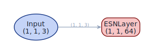

<span class="nb-kicker">Build · Architecture</span>

# linear_esn

A reservoir with the nonlinearity removed and no readout attached: the
model's output *is* the state sequence of a linear dynamical system. This
is an analysis instrument, not a forecaster.

## Wiring

`Input → Reservoir(activation="identity")`

With identity activation the update reduces to a driven linear recurrence,

$$x_t = (1-a)\,x_{t-1} + a\,\bigl(W x_{t-1} + W_{\text{fb}}\,u_t + b\bigr),$$

so the eigenvalues of $W$ govern everything — `spectral_radius` and the
`topology` spec act on the dynamics directly, with no saturation in the
way. The factory forces `activation="identity"` and accepts no readout
arguments; passing `readout_alpha` or `output_size` raises `TypeError`.

<figure markdown>

<figcaption>Generated by plot_model from the factory.</figcaption>
</figure>

## Use

```python
import torch
from resdag.models import linear_esn

model = linear_esn(reservoir_size=200, feedback_size=1)
states = model(torch.randn(1, 500, 1))    # (1, 500, 200) — states are the output

# Effective dimensionality of the linear response
S = torch.linalg.svdvals(states[0])
participation = (S.sum() ** 2 / (S**2).sum()).item()
```

Honest use cases:

- **Spectral analysis.** Isolate what a topology and spectral radius do to
  the state dynamics before tanh compresses the picture — compare the
  state spectrum across [topology specs](../initialization/index.md) with
  the nonlinearity held out of the experiment.
- **Memory-capacity studies.** Linear reservoirs are the reference case in
  short-term-memory analysis; drive with white noise and regress delayed
  inputs from `states` to trace the capacity curve.
- **Ablation baseline.** Any gain a nonlinear ESN shows over this model on
  the same topology is attributable to the nonlinearity, not the recurrence.

## Parameters

| Parameter | Default | Notes |
| --- | --- | --- |
| `reservoir_size`, `feedback_size` | required | units, input dim — no `output_size` |
| `topology`, `feedback_initializer` | `None` | any [initialization spec](../initialization/index.md) |
| `spectral_radius` | `0.9` | acts directly on the linear spectrum |
| `leak_rate` | `1.0` | `1.0` = no leak |
| `bias`, `trainable` | `True`, `False` | random bias on; frozen weights |
| `**reservoir_kwargs` | — | forwarded to `ESNLayer` — but `activation` is fixed to `"identity"` |

## Reference

H. Jaeger, *Short term memory in echo state networks*, GMD Report 152,
German National Research Center for Information Technology (2001) — the
canonical memory-capacity analysis these linear probes descend from.

## See also

- [headless_esn](headless-esn.md) — the same readout-free pattern with the nonlinearity kept.
- [Layers](../layers/index.md) — `ESNLayer`, the single component this factory wraps.
- [Models reference](../../reference/models.md) — full factory signature.
