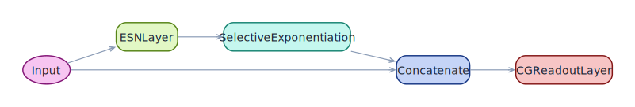

<span class="nb-kicker">Build · Architecture</span>

# ott_esn

A classic ESN with one additional transform that squares half the reservoir
states before the readout, introduced by Pathak et al. (2018) for
forecasting chaotic systems.

## Wiring

`Input → Reservoir → SelectiveExponentiation → Concatenate(Input, Augmented) → Readout`

`SelectiveExponentiation(index=0, exponent=2.0)` squares the even-indexed
state units and passes the odd-indexed ones through untouched. A tanh
reservoir is an odd function of its drive, so without this the readout only
sees odd-order terms, and an autonomous forecast can settle onto the mirror
image of the attractor. Squaring half the units gives the readout
even-order features and breaks that symmetry, while the concatenation keeps
the raw input available as in [classic_esn](classic-esn.md). The factory
builds the readout as a [CGReadoutLayer](../readouts/cg-readout.md).

<figure markdown>

<figcaption>Computation graph of <code>ott_esn</code>.</figcaption>
</figure>

## Use

```python
import torch
from resdag.models import ott_esn
from resdag.training import ESNTrainer

series = torch.cumsum(0.1 * torch.randn(1, 1201, 3), dim=1)

model = ott_esn(
    reservoir_size=500, feedback_size=3, output_size=3,
    topology=("watts_strogatz", {"k": 6, "p": 0.3}),
    spectral_radius=0.95,
)
ESNTrainer(model).fit(
    warmup_inputs=(series[:, :200],),
    train_inputs=(series[:, 200:1200],),
    targets={"output": series[:, 201:1201]},
)
preds = model.forecast(series[:, :200], horizon=100)   # (1, 100, 3)
```

## Parameters

| Parameter | Default | Notes |
| --- | --- | --- |
| `reservoir_size`, `feedback_size`, `output_size` | required | units, input dim, output dim |
| `topology`, `feedback_initializer` | `None` | any [initialization spec](../initialization/index.md) |
| `spectral_radius` | `0.9` | the factory scales; the bare `ESNLayer` defaults to `None` |
| `leak_rate` | `1.0` | `1.0` = no leak |
| `activation` | `"tanh"` | also `"relu"`, `"sigmoid"`, `"identity"` |
| `bias`, `trainable` | `True`, `False` | random bias on; frozen reservoir |
| `readout_alpha`, `readout_bias`, `readout_name` | `1e-6`, `True`, `"output"` | ridge strength; `readout_name` keys the targets dict |
| `**reservoir_kwargs` | — | forwarded to `ESNLayer` (e.g. `bias_scaling`) |

## Reference

J. Pathak, B. Hunt, M. Girvan, Z. Lu, and E. Ott, *Model-Free Prediction
of Large Spatiotemporally Chaotic Systems from Data: A Reservoir Computing
Approach*, Phys. Rev. Lett. **120**, 024102 (2018). The factory name
follows the common attribution of this architecture to Edward Ott's group;
the paper's first author is Pathak.

## See also

- [power_augmented](power-augmented.md) — the same augmentation with a configurable exponent.
- [Forecast](../../workflows/forecast.md) — the autoregression contract behind `forecast()`.
- [Models reference](../../reference/models.md) — full factory signature.
