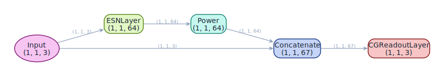

<span class="nb-kicker">Build · Architecture</span>

# power_augmented

The quadratic augmentation of [ott_esn](ott-esn.md), generalized: every
reservoir state is raised to a configurable `exponent` before the readout,
and the exponent becomes a hyperparameter you can sweep.

## Wiring

`Input → Reservoir → Power(exponent) → Concatenate(Input, Augmented) → Readout`

Two differences from `ott_esn`, both deliberate. The exponent is free
rather than fixed at 2, and `Power` transforms *every* state unit rather
than every other one — at `exponent=2.0` the readout sees only squared
states plus the raw input, where `ott_esn` interleaves squared and raw
units. Whether full or alternating augmentation works better is
system-dependent; this factory exists so you can ask the question.

<figure markdown>

<figcaption>Generated by plot_model from the factory.</figcaption>
</figure>

## Use

```python
import torch
from resdag.models import power_augmented
from resdag.training import ESNTrainer

series = torch.cumsum(0.1 * torch.randn(1, 1201, 3), dim=1)

model = power_augmented(
    reservoir_size=500, feedback_size=3, output_size=3,
    exponent=3.0,                       # odd exponents preserve state signs
)
ESNTrainer(model).fit(
    warmup_inputs=(series[:, :200],),
    train_inputs=(series[:, 200:1200],),
    targets={"output": series[:, 201:1201]},
)
preds = model.forecast(series[:, :200], horizon=100)   # (1, 100, 3)
```

A factory with a continuous hyperparameter is a natural `model_creator` for
[hyperparameter tuning](../../workflows/tune.md) — sweep `exponent`
alongside `spectral_radius` rather than guessing it.

## Parameters

| Parameter | Default | Notes |
| --- | --- | --- |
| `reservoir_size`, `feedback_size`, `output_size` | required | units, input dim, output dim |
| `exponent` | `2.0` | power applied to every reservoir state |
| `topology`, `feedback_initializer` | `None` | any [initialization spec](../initialization/index.md) |
| `spectral_radius`, `leak_rate` | `0.9`, `1.0` | factory scales the spectrum; `1.0` = no leak |
| `activation`, `bias`, `trainable` | `"tanh"`, `True`, `False` | reservoir panel, as in the other factories |
| `readout_alpha`, `readout_bias`, `readout_name` | `1e-6`, `True`, `"output"` | ridge strength; `readout_name` keys the targets dict |
| `**reservoir_kwargs` | — | forwarded to `ESNLayer` (e.g. `bias_scaling`) |

## Reference

None to cite directly — this is a ResDAG generalization of the quadratic
augmentation in Pathak et al., Phys. Rev. Lett. **120**, 024102 (2018),
not an architecture from the literature. If you publish results with it,
describe the augmentation explicitly rather than citing it as standard.

## See also

- [ott_esn](ott-esn.md) — the fixed quadratic, alternating-unit original.
- [Build](../index.md) — the composition handbook this catalog answers.
- [Models reference](../../reference/models.md) — full factory signature.
