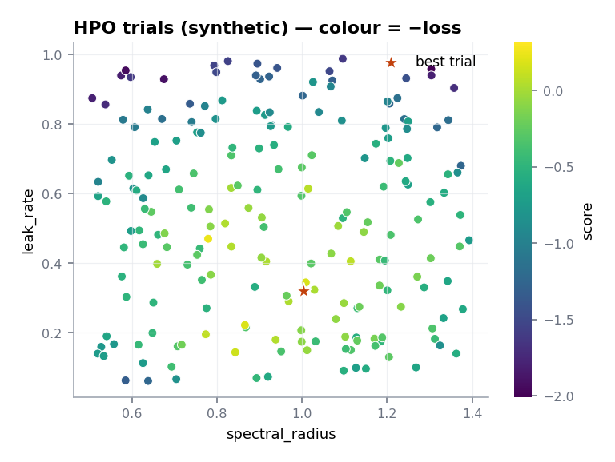

<span class="rd-eyebrow">Cookbook</span>

# Hyperparameter optimization

By the end of this page you'll have a parallel Optuna study searching
reservoir size and spectral radius, optimizing the metric that matters
for chaotic systems: how long the forecast stays good.

```bash
pip install "resdag[hpo]"        # pulls in optuna
```

## The whole thing

`run_hpo` wants three callables — build a model from hyperparameters,
define the search space, load the data — and runs the entire
train-forecast-evaluate loop per trial.

<div class="rd-window" data-title="hpo_study.py" markdown>

```python
import torch
from resdag.hpo import run_hpo, get_best_params, get_study_summary
from resdag.models import ott_esn
from resdag.utils.data import prepare_esn_data

def model_creator(reservoir_size, spectral_radius):
    return ott_esn(
        reservoir_size=reservoir_size,
        feedback_size=3,
        output_size=3,
        spectral_radius=spectral_radius,
    )

def search_space(trial):
    return {
        "reservoir_size": trial.suggest_int("reservoir_size", 200, 800, step=100),
        "spectral_radius": trial.suggest_float("spectral_radius", 0.5, 1.2),
    }

def data_loader(trial):
    t = torch.linspace(0, 200, 10_000)             # stand-in for your series
    data = torch.stack([torch.sin(t), torch.cos(t), torch.sin(2 * t)], -1).unsqueeze(0)
    warmup, train, target, f_warmup, val = prepare_esn_data(
        data, warmup_steps=500, train_steps=8000, val_steps=1000,
    )
    return {"warmup": warmup, "train": train, "target": target,
            "f_warmup": f_warmup, "val": val}

study = run_hpo(
    model_creator=model_creator,
    search_space=search_space,
    data_loader=data_loader,
    n_trials=100,
    loss="efh",
    n_workers=4,
    storage="study.log",                   # journal file — multi-worker safe
    seed=42,
)
print(get_study_summary(study))
best = get_best_params(study)              # dict, ready for model_creator(**best)
```

</div>

The data dict contract is strict: the five keys `"warmup"`, `"train"`,
`"target"`, `"f_warmup"`, `"val"` are required, each a 3-D tensor of
shape `(batch, time, features)`. A malformed dict fails validation in the
first trial — but with the default `catch_exceptions=True` the error is
logged and the trial scores `penalty_value` instead of stopping the study;
pass `catch_exceptions=False` while debugging so it raises immediately.
For input-driven models, pass
`drivers_keys=["wind"]` and add `"warmup_wind"`, `"train_wind"`,
`"f_warmup_wind"`, and `"forecast_wind"` entries.

<figure markdown>

<figcaption>A two-parameter slice of a study. The interesting region is rarely where you would have started by hand.</figcaption>
</figure>

## The losses

Every trial forecasts the validation window; the loss scores `(y_true,
y_pred)`, both `(batch, time, features)`. Lower is always better —
horizon losses return negated horizons.

| Key | What it measures |
|---|---|
| `"efh"` | Expected forecast horizon — smooth proxy for steps below error threshold. The default. |
| `"forecast_horizon"` | Hard count of consecutive valid steps from forecast start. |
| `"lyapunov"` | Time-weighted error with exponential decay, compensating chaotic growth. |
| `"standard"` | Mean geometric-mean error — the plain baseline. |
| `"soft_horizon"` | Horizon via Hill-gate survival probability — a tunable middle ground. |

Pass kwargs through `loss_params={"threshold": 0.3}`, or hand `loss` any
callable `(y_true, y_pred, /, **kwargs) -> float`. To log extra metrics
without optimizing on them, use `monitor_losses=["standard", "lyapunov"]`
with optional `monitor_params` — each lands in `trial.user_attrs["monitor_<fn_name>"]`.

## Parallelism and reproducibility

`n_workers > 1` forks real OS processes (no GIL contention) coordinated
through file storage, throttling BLAS/OpenMP to one thread per worker
first. Use `storage="study.log"` (journal file, append-only, crash-safe)
for multi-worker runs; a `.db` path gets SQLite with WAL mode instead,
and re-running with the same storage resumes the study where it left off.

With `n_workers=1`, `seed=42` seeds the TPE sampler once and each trial's
PyTorch/NumPy state with `seed + trial.number` — trial 17 is trial 17 on
every machine. With multiple workers, each worker derives its own sampler
seed (`seed + i*7919`) and trial numbers depend on scheduling, so runs are
seeded but not number-for-number reproducible.

!!! tip "Taming exploding trials"
    Bad hyperparameters make forecasts diverge and losses explode, which
    skews the sampler. `clip_value` clamps what Optuna sees (the raw
    value is kept in `trial.user_attrs["raw_loss"]`); add
    `prune_on_clip=True` to discard those trials entirely. Failed trials
    return `penalty_value` (default `1e10`) instead of crashing the study.

## Related

- [Tuning](../learn/tuning.md) — which hyperparameters are worth searching.
- [GPU & performance](gpu.md) — device placement and worker thread budgets.
- [Loss reference](../reference/hpo/losses.md) — full signatures and formulas.
