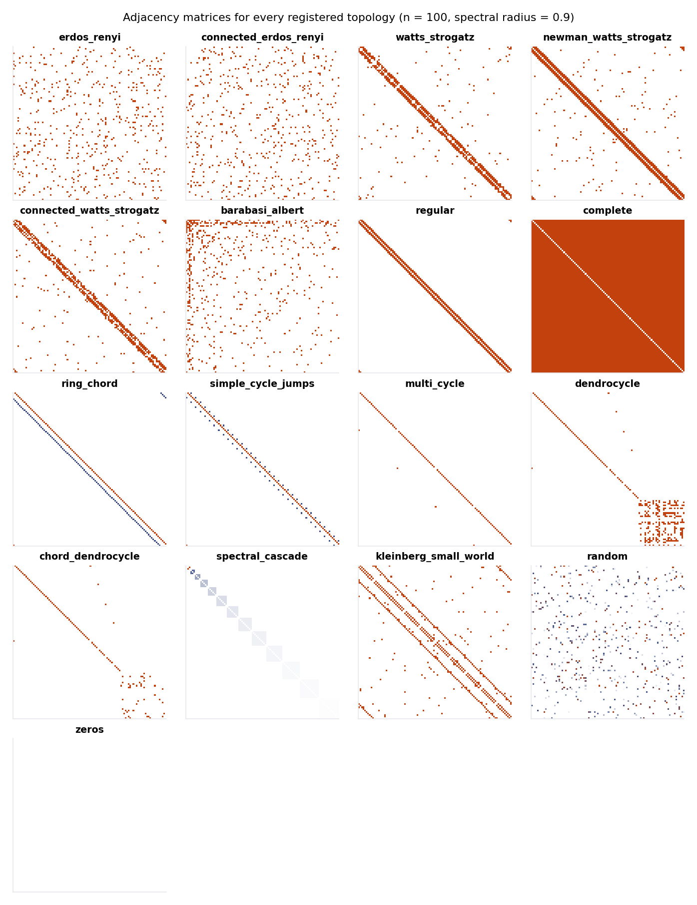

<span class="rd-eyebrow">Cookbook</span>

# Reservoir topologies

The recurrent matrix decides what the reservoir can remember. ResDAG ships
17 graph topologies plus a built-in `"orthogonal"` matrix builder — and any
function producing a square matrix plugs into the same `topology=` keyword.

## Five ways to specify a topology

<div class="rd-window" data-title="topology_specs.py" markdown>

```python
import torch
from resdag import ESNLayer
from resdag.init.topology import get_topology

# 1. Registry name — uses the registered defaults
ESNLayer(500, feedback_size=3, topology="watts_strogatz")

# 2. Name + parameter overrides
ESNLayer(500, feedback_size=3, topology=("watts_strogatz", {"k": 6, "p": 0.3}))

# 3. Pre-configured object — reusable across layers, seedable
ESNLayer(500, feedback_size=3, topology=get_topology("barabasi_albert", m=3, seed=42))

# 4. Any callable fn(n, **kw) -> (n, n) tensor, ndarray, or nx graph
def lowrank(n, rank=10):
    return torch.randn(n, rank) @ torch.randn(n, rank).T / rank

ESNLayer(500, feedback_size=3, topology=lowrank)
ESNLayer(500, feedback_size=3, topology=(lowrank, {"rank": 20}))

# 5. torch.nn.init in-place functions work as-is
ESNLayer(500, feedback_size=3, topology=torch.nn.init.orthogonal_)
```

</div>

Formats 4 and 5 are wrapped in
[`MatrixTopology`](../reference/init/topology.md) automatically: build-style
`fn(n, **kw)` is tried first, then in-place `fn(tensor, **kw)` — the
`torch.nn.init.*_` convention. One matrix topology ships built in:
`topology=("orthogonal", {"seed": 42})` draws a Haar-random orthogonal
matrix via QR — all singular values 1, norm-preserving dynamics, a strong
pick for memory-heavy tasks.

## The 17 graph topologies

<figure markdown>

<figcaption>Every graph topology as a 100-unit connectivity matrix, defaults, spectral radius 0.9.</figcaption>
</figure>

| Name | Character |
|---|---|
| `barabasi_albert` | Scale-free via preferential attachment — a few hub units dominate. |
| `chord_dendrocycle` | Dendrocycle plus small-world chords on the core ring. |
| `complete` | Every pair connected; dense deterministic baseline. |
| `connected_erdos_renyi` | Erdős–Rényi, resampled until connected. |
| `connected_watts_strogatz` | Watts–Strogatz, resampled until connected. |
| `dendrocycle` | Core directed cycle with dendritic chains hanging off it. |
| `erdos_renyi` | Each edge present with probability `p`; the classic sparse random choice. |
| `kleinberg_small_world` | Toroidal grid + distance-biased long-range links. |
| `multi_cycle` | Disjoint union of `k` identical directed cycles. |
| `newman_watts_strogatz` | Ring with shortcuts added, none removed. |
| `random` | Dense uniform(-1, 1) weights at a given density. |
| `regular` | Ring lattice, `k//2` neighbors per side (odd `k` is floored to even). |
| `ring_chord` | Directed ring plus geometrically-weighted backward chords. |
| `simple_cycle_jumps` | One directed cycle with bidirectional jump edges. |
| `spectral_cascade` | Disconnected cliques of sizes 1..N, each spectrally scaled. |
| `watts_strogatz` | Small-world: clustered ring with rewired shortcuts. |
| `zeros` | No recurrence at all — your sanity-check control. |

`show_topologies()` lists these at runtime; `show_topologies("watts_strogatz")` prints one topology's parameters.

## Registering your own

One decorator makes a name available everywhere — `ESNLayer`, every premade
factory, HPO search spaces. Graph builders return a weighted NetworkX graph,
matrix builders return the matrix itself (the `lowrank` from format 4,
registered, becomes addressable by name):

```python
import networkx as nx
import torch
from resdag import ESNLayer
from resdag.init.topology import register_graph_topology, register_matrix_topology

@register_graph_topology("two_rings", k=2)
def two_rings(n, k=2, seed=None):
    G = nx.DiGraph()                       # k disjoint directed rings
    size = n // k
    for r in range(k):
        nx.add_cycle(G, range(r * size, (r + 1) * size), weight=1.0)
    G.add_nodes_from(range(k * size, n))   # pad leftover nodes
    return G

@register_matrix_topology("lowrank", rank=10)
def lowrank(n, rank=10):
    return torch.randn(n, rank) @ torch.randn(n, rank).T / rank

reservoir = ESNLayer(500, feedback_size=3, topology=("lowrank", {"rank": 20}))
```

!!! note "Spectral radius is applied after construction — always"
    Whatever built the matrix — graph, callable, `torch.nn.init`, registry —
    the layer's `spectral_radius` rescales it afterwards. Topology controls
    *which* weights exist; spectral radius controls *how big* they are.
    Re-tune it when you switch: the same value produces very different
    dynamics on different structures.

## Related

- [Input & feedback initializers](initializers.md) — the same five formats, for the rectangular matrices.
- [Custom components](custom-components.md) — registration rules for everything extendable.
- [Reservoir equations](../under-the-hood/reservoir-equations.md) — where the recurrent matrix enters the update.
