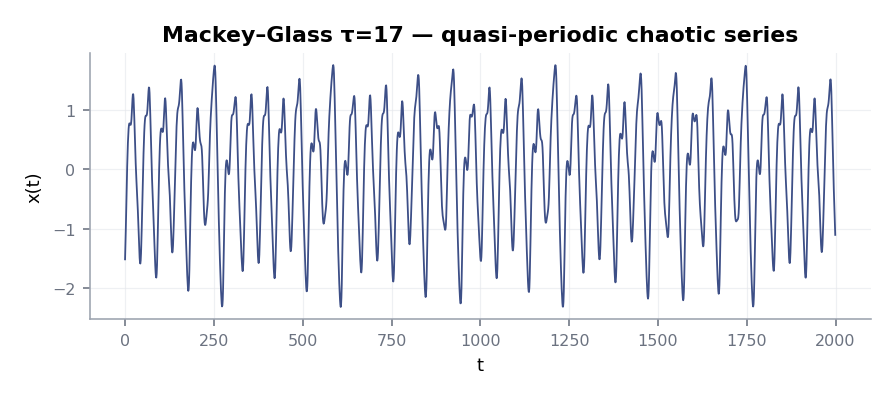

# Mackey–Glass

A delay-differential equation that produces *quasi-periodic chaos* —
useful as a second test case for ESNs because its dynamics differ
qualitatively from Lorenz.

$$
\dot{x}(t) = \beta\,\frac{x(t - \tau)}{1 + x(t - \tau)^{n}} - \gamma\,x(t)
$$

With $\beta=0.2$, $\gamma=0.1$, $n=10$, $\tau=17$ the trajectory is
chaotic on a relatively low-dimensional attractor:

<figure markdown>
  { width="720" }
  <figcaption>2 000-step window of a normalised Mackey–Glass series
  (τ = 17).</figcaption>
</figure>

## Generate

```python
import numpy as np
import torch

def mackey_glass(n=4000, tau=17, beta=0.2, gamma=0.1, n_exp=10, dt=1.0, seed=11):
    rng = np.random.default_rng(seed)
    history = rng.uniform(0.5, 1.5, size=max(tau, 1))
    out = np.zeros(n)
    out[: len(history)] = history
    for i in range(len(history), n):
        x_tau = out[i - tau]
        x = out[i - 1]
        dx = beta * x_tau / (1 + x_tau ** n_exp) - gamma * x
        out[i] = x + dt * dx
    out = (out - out.mean()) / out.std()
    return torch.tensor(out, dtype=torch.float32).view(1, -1, 1)
```

## Train

```python
from resdag import ott_esn
from resdag.training import ESNTrainer
from resdag.utils.data import prepare_esn_data

data = mackey_glass(8_000)

warmup, train, target, f_warmup, val = prepare_esn_data(
    data,
    warmup_steps=500,
    train_steps=5_000,
    val_steps=1_500,
    discard_steps=500,
    normalize=True,
)

model = ott_esn(
    reservoir_size=500, feedback_size=1, output_size=1,
    spectral_radius=1.05, leak_rate=0.4,
)
ESNTrainer(model).fit(
    warmup_inputs=(warmup,),
    train_inputs=(train,),
    targets={"output": target},
)
model.reset_reservoirs()
pred = model.forecast(f_warmup, horizon=val.shape[1])
print("val MSE:", float(((pred - val) ** 2).mean()))
```

## Notes

- Mackey–Glass benefits from a slightly **lower** leak rate (`~0.3–0.5`) — the
  system has long-memory components that are easier to capture with a
  slowly-integrating reservoir.
- Comparing the same setup against [Lorenz](lorenz.md) is a useful
  exercise: the spectral radius / leak rate / reservoir size sweet spot
  differs.
- The Mackey–Glass series is a fixture in the reservoir-computing
  literature; the
  [related-work page](../about/related-work.md) lists papers worth
  benchmarking against.
