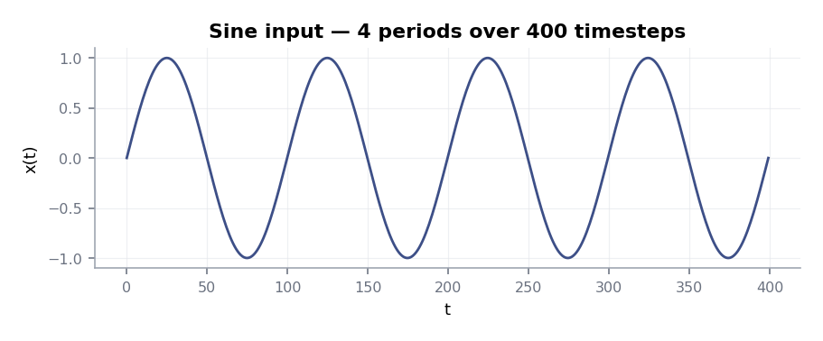
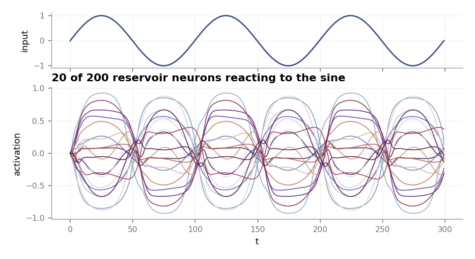
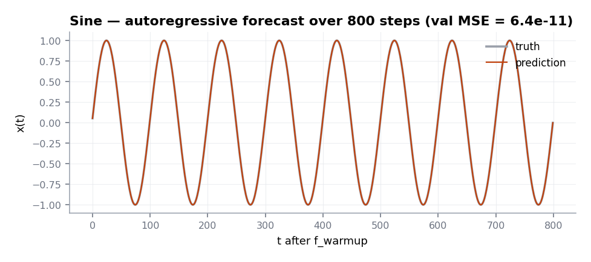

# Sine forecasting

The simplest end-to-end example: generate a sine, split it with
`prepare_esn_data`, train a `classic_esn`, and forecast the held-out
tail. With sensible hyperparameters the forecast tracks the truth to
near machine precision.

## Data

```python
import torch

t = torch.linspace(0, 60 * 2 * torch.pi, 6_000)
data = torch.sin(t).view(1, -1, 1)
```

<figure markdown>
  { width="720" }
  <figcaption>Four periods of a unit-amplitude sine. The full series in
  the script is 6 000 steps (60 cycles).</figcaption>
</figure>

## Reservoir activations

A 200-unit reservoir driven by the sine produces a rich set of
time-varying activations. The readout will regress against these:

<figure markdown>
  { width="720" }
  <figcaption>20 of 200 reservoir neurons (lower panel) reacting to the
  input signal (upper panel). Each neuron is a different lagged,
  filtered version of the input.</figcaption>
</figure>

## Train and forecast

```python
from resdag import classic_esn
from resdag.training import ESNTrainer
from resdag.utils.data import prepare_esn_data

torch.manual_seed(0)

warmup, train, target, f_warmup, val = prepare_esn_data(
    data,
    warmup_steps=500,
    train_steps=4_500,
    val_steps=800,
    normalize=False,
)

model = classic_esn(
    reservoir_size=300,
    feedback_size=1,
    output_size=1,
    spectral_radius=0.99,
    leak_rate=0.3,
    readout_alpha=1e-8,
)

ESNTrainer(model).fit(
    warmup_inputs=(warmup,),
    train_inputs=(train,),
    targets={"output": target},
)

model.reset_reservoirs()
pred = model.forecast(f_warmup, horizon=val.shape[1])
print("val MSE:", float(((pred - val) ** 2).mean()))   # ≈ 6e-11
```

## Result

<figure markdown>
  { width="720" }
  <figcaption>800-step autoregressive forecast (amber) on the held-out
  validation segment (grey). The reservoir locks phase and amplitude
  with no teacher forcing — the lines are visually indistinguishable.</figcaption>
</figure>

## What to try next

- Switch to [`ott_esn`](../reference/models.md) — even on a simple sine
  the state augmentation typically helps for longer horizons.
- Drop `spectral_radius` to `0.5` to see the forecast lose phase memory
  and slowly drift.
- Increase `readout_alpha` to `1e-4` to watch the amplitude blur as the
  ridge penalty starts to dominate.
- Replicate this on a noisier signal (`data + 0.05 * torch.randn_like(data)`)
  and re-tune `readout_alpha`.
