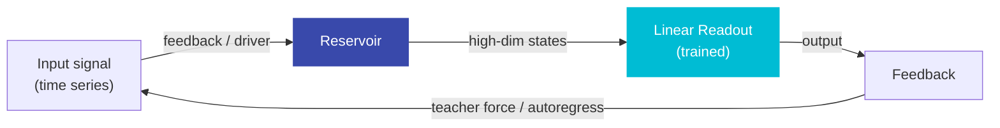
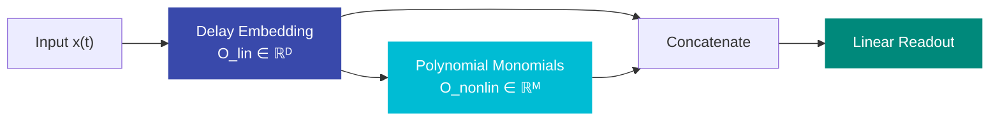
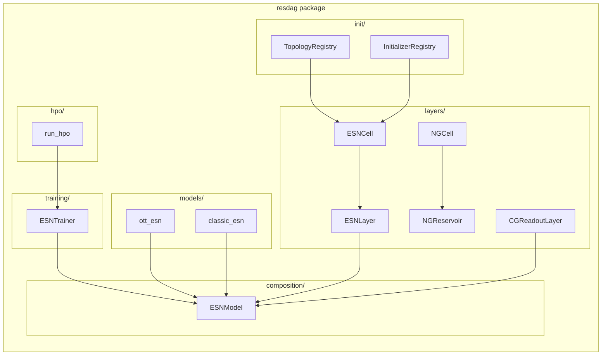

# Core Concepts

This page explains the key ideas behind reservoir computing and how resdag implements them.

---

## What is Reservoir Computing?

**Reservoir Computing** is a machine learning paradigm where a high-dimensional, fixed dynamical system (the *reservoir*) projects input signals into a rich feature space, and only a simple linear readout is trained on top.

The reservoir is **randomly initialized and frozen** — only the readout weights are learned. This makes training extremely fast (a single linear solve) while the reservoir's nonlinear dynamics provide expressive features.

---

## Echo State Networks (ESN)

An **Echo State Network** is the most common reservoir computing architecture. It consists of:

| Component | Description | Trained? |
|---|---|---|
| Reservoir | Recurrent network of tanh neurons | No (frozen) |
| Input weights \(W_{in}\) | Map input → reservoir | No |
| Feedback weights \(W_{fb}\) | Map previous output → reservoir | No |
| Recurrent weights \(W\) | Internal reservoir connections | No |
| Readout \(W_{out}\) | Map reservoir states → output | **Yes** |

### The ESN Update Equation

At each timestep \(t\):

\[
\mathbf{h}(t) = (1 - \alpha)\,\mathbf{h}(t-1) + \alpha \cdot f\!\left(W\,\mathbf{h}(t-1) + W_{fb}\,\mathbf{y}(t-1) + W_{in}\,\mathbf{u}(t) + \mathbf{b}\right)
\]

where:

- \(\mathbf{h}(t) \in \mathbb{R}^N\) — reservoir state
- \(\alpha \in (0, 1]\) — leak rate (1 = no leaking)
- \(f\) — activation function (typically tanh)
- \(\mathbf{y}(t-1)\) — previous output (feedback)
- \(\mathbf{u}(t)\) — optional driving input

The output is computed as:

\[
\mathbf{y}(t) = W_{out}\,\mathbf{h}(t)
\]

### Echo State Property

The **Echo State Property (ESP)** guarantees that the reservoir state is uniquely determined by the recent history of inputs, regardless of initial conditions. This is the key stability property required for ESNs to work.

For a reservoir with spectral radius \(\rho(W) < 1\), the ESP is typically satisfied. The spectral radius controls the *memory* of the network:

- \(\rho \approx 1\) → long memory, better for slow dynamics
- \(\rho \ll 1\) → short memory, better for fast dynamics

!!! warning "Spectral Radius Rule of Thumb"
    Setting `spectral_radius < 1` is a sufficient condition for the ESP in noise-free settings,
    but chaotic systems sometimes benefit from `spectral_radius ≥ 1`. Always validate empirically.

---

## Next Generation RC (NG-RC)

**Next Generation Reservoir Computing** (Gauthier et al., 2021) replaces the recurrent reservoir with a purely mathematical feature map:

1. **Delay embedding**: stack the current input with \((k-1)\) delayed copies at spacing \(s\)
2. **Polynomial monomials**: compute all degree-\(p\) monomials of the embedded vector

**Feature dimension**: \(\text{int}(c) + \text{int}(l) \cdot D + \binom{D+p-1}{p}\) where \(D = d \cdot k\)

Key advantages over ESN:

- No recurrent weights, no spectral radius tuning
- Exact reproducibility (deterministic)
- Fewer hyperparameters
- Excellent for low-dimensional systems

!!! warning "Combinatorial Explosion"
    High values of `k`, `p`, or `input_dim` cause \(\binom{D+p-1}{p}\) to grow very rapidly.
    resdag warns when `feature_dim > 10,000`.

---

## The Training Paradigm

resdag uses **algebraic training** — not SGD. The readout is fitted by solving a ridge regression problem:

\[
W_{out} = \arg\min_{W} \|W H - Y\|_F^2 + \alpha \|W\|_F^2
\]

This is solved via **Conjugate Gradient** (hence `CGReadoutLayer`) in `float64` for numerical stability. The solution is exact, fast, and requires no learning rate tuning.

### Training Phases

  

    
1

    

  

  

    <h4>Warmup (State Synchronization)</h4>
    
Teacher-forced forward pass through warmup data. The reservoir state converges to a trajectory determined by the input, forgetting the arbitrary initial state. This exploits the Echo State Property.

  

  

    
2

    

  

  

    <h4>Readout Fitting</h4>
    
A single forward pass through training data collects all reservoir states H ∈ ℝT×N. Each readout layer solves its ridge regression <em>as</em> the pass reaches it (via pre-hooks), in topological order.

  

  

    
3

  

  

    <h4>Closed-Loop Forecasting</h4>
    
After a second warmup, the model rolls out autonomously: each prediction becomes the next feedback input. For chaotic systems, accuracy is measured in Lyapunov times.

  

---

## resdag Architecture Overview

---

## Tensor Conventions

All tensors in resdag use **batch-first, time-second** layout:

| Shape | Meaning |
|---|---|
| `(batch, time, features)` | Input / output sequences |
| `(batch, reservoir_size)` | ESN reservoir state |
| `(batch, state_size, input_dim)` | NG-RC delay buffer state |

The first input to `ESNLayer.forward()` is always the **feedback** signal. Additional positional arguments are **driving inputs**.

---

## Key Hyperparameters

| Parameter | Effect | Typical Range |
|---|---|---|
| `reservoir_size` | Capacity / expressivity | 100 – 5000 |
| `spectral_radius` | Memory / stability | 0.5 – 1.5 |
| `leak_rate` | Temporal smoothing | 0.1 – 1.0 |
| `alpha` (readout) | Ridge regularization | 1e-8 – 1e-2 |
| `topology` | Connectivity structure | see [Topologies](../guide/topologies.md) |

---

## References

1. **Jaeger (2001)**: The echo state approach to analysing and training recurrent neural networks. GMD Report 148.
2. **Maass et al. (2002)**: Real-time computing without stable states. *Neural Computation* 14(11).
3. **Lukoševičius & Jaeger (2009)**: Reservoir computing approaches to recurrent neural network training. *Computer Science Review*.
4. **Ott et al. (2018)**: Model-free prediction of large spatiotemporally chaotic systems. *Phys. Rev. Lett.* 120.
5. **Gauthier et al. (2021)**: Next generation reservoir computing. *Nature Communications* 12, 5564.
