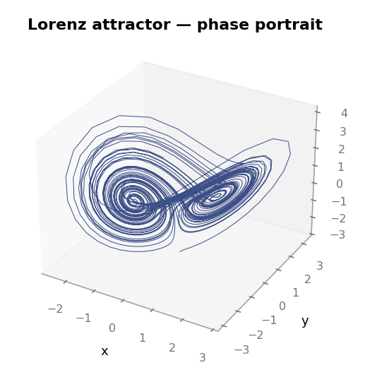
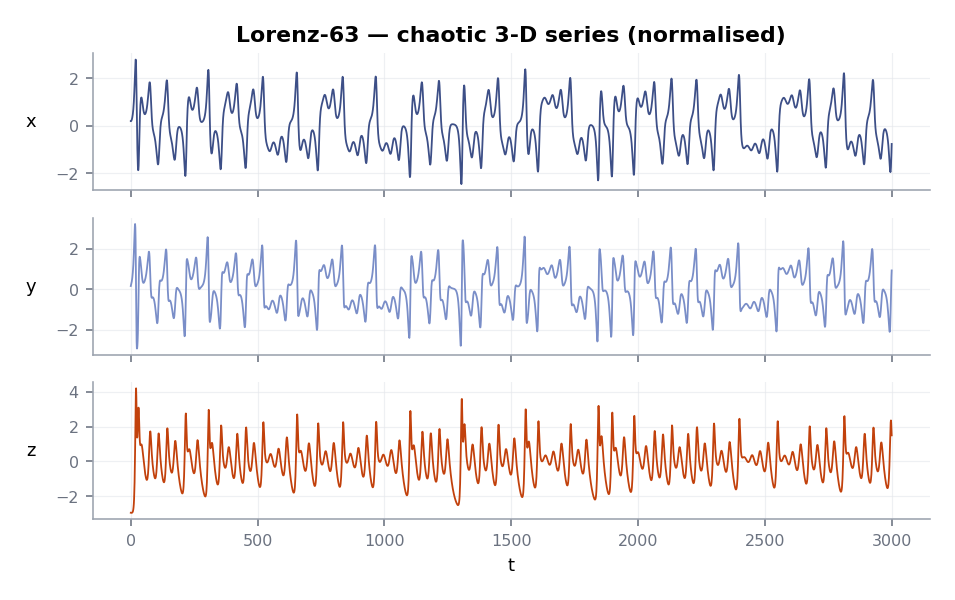

# Lorenz walkthrough

Same workflow as [Your first ESN](your-first-esn.md), now on a chaotic
3-dimensional system. Chaos changes the rules: there is a fundamental
limit on how far ahead any predictor can stay accurate, set by the
positive Lyapunov exponent of the system. The metric of interest is
*how many Lyapunov times* the forecast tracks before drift dominates.

## The system

<figure markdown>
  { width="460" }
  <figcaption>Phase portrait of Lorenz-63 — the canonical "butterfly"
  attractor.</figcaption>
</figure>

<figure markdown>
  { width="720" }
  <figcaption>The three state coordinates over 3 000 timesteps,
  normalised to unit variance. Note the slow flips between the two
  attractor lobes.</figcaption>
</figure>

## Train and forecast

```python
import torch
from resdag import ott_esn
from resdag.training import ESNTrainer
from resdag.utils.data import prepare_esn_data


def lorenz63(n_steps: int = 40_000, dt: float = 0.02, seed: int = 42) -> torch.Tensor:
    torch.manual_seed(seed)
    xyz = torch.zeros(n_steps, 3)
    xyz[0] = torch.tensor([1.0, 1.0, 1.0])
    sigma, rho, beta = 10.0, 28.0, 8.0 / 3.0
    for t in range(1, n_steps):
        x, y, z = xyz[t - 1]
        d = torch.stack([sigma * (y - x), x * (rho - z) - y, x * y - beta * z])
        xyz[t] = xyz[t - 1] + dt * d
    return ((xyz - xyz.mean(0)) / xyz.std(0)).unsqueeze(0)


data = lorenz63()
torch.manual_seed(1)   # controls reservoir initialisation

warmup, train, target, f_warmup, val = prepare_esn_data(
    data,
    warmup_steps=2_000,
    train_steps=20_000,
    val_steps=1_500,
    discard_steps=3_000,
    normalize=True,
    norm_method="minmax",
)

model = ott_esn(
    reservoir_size=1_500,
    feedback_size=3,
    output_size=3,
    spectral_radius=1.0,
    leak_rate=1.0,
    readout_alpha=1e-7,
)

ESNTrainer(model).fit(
    warmup_inputs=(warmup,),
    train_inputs=(train,),
    targets={"output": target},
)

model.reset_reservoirs()
pred = model.forecast(f_warmup, horizon=val.shape[1])
print("val MSE:", float(((pred - val) ** 2).mean()))
```

## Forecast quality

The model tracks the attractor for ~292 timesteps (5.3 Lyapunov times)
before phase drift becomes visible — in line with published ESN results
on Lorenz-63.

<figure markdown>
  { width="720" }
  <figcaption>Component-wise overlay of the autoregressive forecast (amber)
  on the held-out truth (grey). The dashed line marks where the running
  RMSE first crosses 0.5.</figcaption>
</figure>

The 3-D view is more revealing: during the accurate window the prediction
traces the *correct* attractor — both lobes, right angle, right
amplitude. Long-term forecasting in a chaotic system is impossible in
principle; learning the *attractor* is the right goal:

<figure markdown>
  { width="720" }
  <figcaption>First 372 forecast steps in phase space. The ESN finds the
  butterfly geometry from autoregressive feedback alone.</figcaption>
</figure>

## Why these hyperparameters

| Knob | Value | Why |
|------|-------|-----|
| `ott_esn` factory | — | Ott's state augmentation (squaring even-indexed reservoir units) handles Lorenz's parity better than vanilla ESN. |
| `reservoir_size=1500` | large | Chaos demands a high-dimensional reservoir state — published Lorenz results use 300 – 5 000 units. |
| `spectral_radius=1.0` | edge | At the edge of chaos the reservoir has rich, long-lived dynamics. Below 0.9 it forgets too fast; above 1.1 it goes unstable in autoregressive mode. |
| `leak_rate=1.0` | none | Lorenz changes on the same timescale as the integrator step; no leak needed. |
| `readout_alpha=1e-7` | low | More regularization smooths out the high-frequency content the model needs to follow. |
| default topology | uniform random | Dense uniform fill is the most robust starting point. Sparse graph topologies can help — see [Graph topologies](../guides/topologies.md). |
| `train_steps=20 000` | many | About 4 Lorenz timescales — enough for the ridge solve to see every region of the attractor. |

## Pushing further

- HPO over `(reservoir_size, spectral_radius, leak_rate, readout_alpha,
  topology)` with `loss="efh"` typically gains 50–100 more accurate
  steps. See the [HPO guide](../guides/hyperparameter-optimization.md).
- A [coupled ensemble](../guides/coupled-ensembles.md) of 5–10 of these
  models averages out the per-seed drift and adds another 50–100 steps.
- For state-of-the-art Lorenz forecasting (1 000+ steps), references like
  Pathak 2018 use 5 000-unit reservoirs with very long training (10⁵
  steps) — directly buildable with ResDAG, just slower to train.

## Next

- [Forecasting chaotic systems](../guides/chaotic-systems.md) — guide-level
  treatment with tuning notes.
- [Examples › Lorenz-63](../examples/lorenz.md) — a longer, fully worked
  variant.
