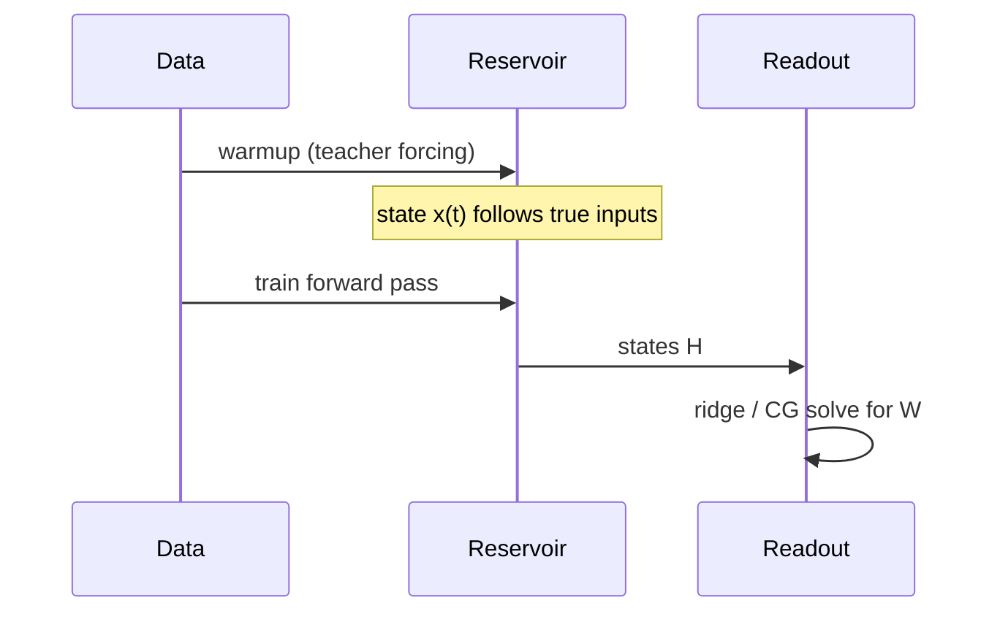

# Mental model

Reservoir computing looks complicated in papers but the software story in ResDAG
is short.

## The core idea

1. **Reservoir** — a large, random, recurrent network with **frozen** weights.
   It turns an input time series into a rich state trajectory.
2. **Readout** — a **linear** map from reservoir states to outputs, fit by
   **ridge regression** (not SGD).
3. **Forecasting** — feed the model's own prediction back as input
   (autoregression) after a teacher-forced **warmup**.

If you remember nothing else:

- The reservoir is a fixed feature extractor; you only tune readout regularization
  (`alpha`) and reservoir *hyperparameters* (size, spectral radius, topology).
- Training is **two phases**: warmup synchronizes internal state; one forward pass
  fits the readout.
- The first output dimension used for feedback must match the feedback input size
  when you call `model.forecast()`.

## Two-phase training

Warmup teaches the reservoir *where* to start in state space. The training pass
collects all states and solves for readout weights in one shot (`ESNTrainer`).

## Where ResDAG adds structure

| Concept | ResDAG type |
|---------|-------------|
| Single-step dynamics | `ESNCell`, `NGCell` |
| Sequence + state API | `ESNLayer`, `NGReservoir` |
| Full graph + forecast | `ESNModel` |
| Readout fitting | `CGReadoutLayer` + `ESNTrainer` |

See [Reservoir layers](../learn/reservoir-layers.md) and
[two-phase training](../learn/two-phase-training.md) for the full narrative.

## Next

[Your first ESN](your-first-esn.md) puts this into code.
