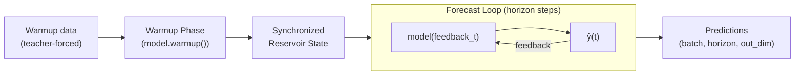

# Model Composition

`ESNModel` wraps `pytorch_symbolic.SymbolicModel` to provide reservoir-specific utilities (state management, forecasting, warmup) on top of a flexible functional model-building API.

---

## Building Models

Models are built using the `pytorch_symbolic` functional API. The pattern is:

```python
import pytorch_symbolic as ps
from resdag import ESNModel

# 1. Create symbolic inputs
inp = ps.Input((seq_len, features))

# 2. Apply layers (each call returns a symbolic node)
x = SomeLayer(...)(inp)
y = AnotherLayer(...)(x)

# 3. Wrap into ESNModel
model = ESNModel(inp, y)
```

The `ps.Input(shape)` takes the **per-sample** shape (no batch dimension).

---

## Single-Input Models

```python
import pytorch_symbolic as ps
from resdag import ESNModel, ESNLayer, CGReadoutLayer

inp = ps.Input((100, 3))                              # (seq_len=100, features=3)
reservoir = ESNLayer(500, feedback_size=3)(inp)
readout   = CGReadoutLayer(500, 3, name="output")(reservoir)
model     = ESNModel(inp, readout)
```

---

## Multi-Input Models (with Driving Signal)

```python
feedback = ps.Input((100, 3))   # feedback: model output fed back in
driver   = ps.Input((100, 5))   # driving input: exogenous signal

reservoir = ESNLayer(500, feedback_size=3, input_size=5)(feedback, driver)
readout   = CGReadoutLayer(500, 3, name="output")(reservoir)
model     = ESNModel([feedback, driver], readout)

# Training
trainer.fit(
    warmup_inputs=(w_fb, w_drv),
    train_inputs=(t_fb, t_drv),
    targets={"output": targets},
)

# Forecasting requires future driver values
preds = model.forecast(
    w_fb, w_drv,
    horizon=500,
    forecast_drivers=(future_driver,),
)
```

---

## Multi-Output Models

```python
inp = ps.Input((100, 3))
res = ESNLayer(500, feedback_size=3)(inp)

pos_out = CGReadoutLayer(500, 3, name="position")(res)
vel_out = CGReadoutLayer(500, 3, name="velocity")(res)

model = ESNModel(inp, [pos_out, vel_out])
```

---

## Stacked / Deep Reservoirs

Chain reservoirs where the output of one feeds the next:

```python
inp  = ps.Input((100, 1))
res1 = ESNLayer(200, feedback_size=1)(inp)               # feedback=1
res2 = ESNLayer(300, feedback_size=200)(res1)            # feedback=200 (res1 size)
out  = CGReadoutLayer(300, 1, name="output")(res2)
model = ESNModel(inp, out)
```

---

## Complex DAG Architectures

```python
# Two separate input streams
fb  = ps.Input((1, 1))
d1  = ps.Input((1, 1))
d2  = ps.Input((1, 2))

res1    = ESNLayer(100, feedback_size=1, input_size=1)(fb, d1)
out1    = CGReadoutLayer(100, 2)(res1)

res2    = ESNLayer(80, feedback_size=2, input_size=2)(out1, d2)
out2    = CGReadoutLayer(80, 1, name="output")(res2)
extras  = CGReadoutLayer(80, 15, name="extras")(res2)

model = ESNModel(inputs=(fb, d1, d2), outputs=(out2, extras))
```

---

## ESNModel API

### State Management

```python
model.reset_reservoirs()                 # reset all reservoir states to None
model.set_random_reservoir_states()      # set all states to standard-normal

states = model.get_reservoir_states()    # dict: name → state tensor clone
model.set_reservoir_states(states)       # restore from dict
```

### Warmup

```python
# Synchronize reservoir states without returning outputs
model.warmup(*inputs)

# Return outputs for visualization
outputs = model.warmup(*inputs, return_outputs=True)
```

### Forecasting

```python
# Feedback-only
preds = model.forecast(warmup_data, horizon=1000)

# With drivers
preds = model.forecast(
    warmup_feedback, warmup_driver,
    horizon=1000,
    forecast_drivers=(future_driver,),
)

# Include warmup predictions in output
full_out = model.forecast(warmup_data, horizon=1000, return_warmup=True)
```

### Inspection

```python
model.summary()         # text summary of all layers
model.plot_model()      # graphviz visualization
model.input_shape       # list of input shapes
model.output_shape      # list of output shapes
```

---

## Forecasting Deep Dive

The `forecast()` method implements a two-phase prediction loop:



**Phase 1 — Warmup**: `model.warmup(*warmup_inputs)` runs teacher-forced forward passes to synchronize states.

**Phase 2 — Autoregression**: The last warmup output becomes the initial feedback. At each step:

- `feedback_t = ŷ(t-1)` (model's own previous prediction)
- `input_drivers_t` = next slice of `forecast_drivers` (if provided)
- `ŷ(t) = model(feedback_t, *drivers_t)` → stored as prediction

!!! note "First Feedback"
    By default, the last output of the warmup phase is used as the initial autoregressive feedback.
    Override with `initial_feedback=tensor` to start from a specific state.

---

## Model Persistence

```python
# Save weights to file
model.save("model.pt")
model.save("checkpoint.pt", include_states=True, epoch=10, loss=0.05)

# Load into existing model (architecture must be re-built first)
model.load("model.pt")
model.load("checkpoint.pt", load_states=True)

# Class method
model = ESNModel.load_from_file("weights.pt", model=pre_built_model)
```

!!! important "Architecture is not saved"
    `save()` / `load()` only handle the **state dict** (weights). You must re-build the same
    model architecture in code before calling `load()`. This is by design — it keeps the format
    simple and PyTorch-native.

---

## API Reference

See the full [ESNModel API reference](../api/composition.md).
