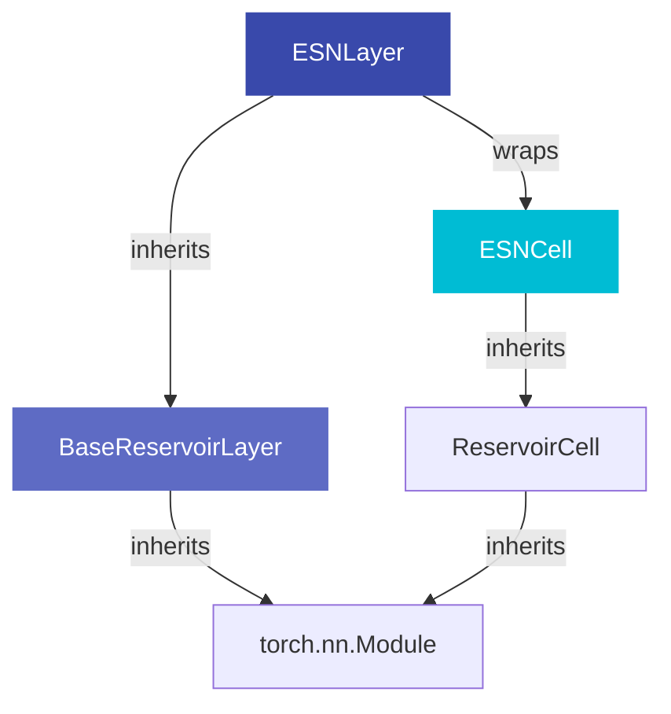

# ESN Layer

`ESNLayer` is the core stateful RNN reservoir layer. It wraps an [`ESNCell`][resdag.layers.cells.ESNCell] (which owns all weights and performs the single-step update) and handles the full sequence loop and state management.

---

## Quick Reference

```python
from resdag.layers import ESNLayer

reservoir = ESNLayer(
    reservoir_size=500,        # (1) number of neurons
    feedback_size=3,           # (2) feedback dimension — REQUIRED
    input_size=None,           # (3) optional driving input dimension
    spectral_radius=0.9,       # (4) target spectral radius
    leak_rate=1.0,             # (5) leaky integration rate
    activation="tanh",         # (6) "tanh" | "relu" | "sigmoid" | "identity"
    bias=True,                 # (7) bias term
    trainable=False,           # (8) frozen weights (standard ESN)
    topology="erdos_renyi",    # (9) recurrent weight graph
    feedback_initializer=None, # (10) feedback weight strategy
    input_initializer=None,    # (11) input weight strategy (if input_size set)
)
```

---

## Parameters

### `reservoir_size` · `int`
Number of reservoir neurons. The hidden state dimension. Larger reservoirs are more expressive but slower.

### `feedback_size` · `int` · **required**
Dimensionality of the feedback signal. In closed-loop forecasting, the model's own output (of this dimension) is fed back as input at each step.

### `input_size` · `int | None` · default `None`
Dimensionality of an optional **driving input** — an exogenous signal not generated by the model itself (e.g., a control signal or covariate). When `None`, no input weight matrix is allocated.

### `spectral_radius` · `float | None` · default `None`
After generating the random recurrent weight matrix, its weights are scaled so the largest absolute eigenvalue equals `spectral_radius`. Controls the memory of the reservoir.

- `None` — no scaling applied (raw random init)
- `< 1` — sufficient condition for Echo State Property in noiseless settings
- `≈ 1` — long memory (good for slow/chaotic dynamics)

### `leak_rate` · `float` · default `1.0`
Leaky integration coefficient \(\alpha \in (0, 1]\). At `1.0` the update is the standard non-leaky ESN. Smaller values smooth the dynamics over time:

\[
h(t) = (1-\alpha)\,h(t-1) + \alpha \cdot f(\ldots)
\]

### `activation` · `str` · default `"tanh"`
Activation function for reservoir neurons. Options: `"tanh"`, `"relu"`, `"sigmoid"`, `"identity"`.

### `bias` · `bool` · default `True`
Whether to include a learned (but frozen by default) bias vector.

### `trainable` · `bool` · default `False`
When `True`, reservoir weights participate in backpropagation. Standard ESNs use `False`.

### `topology` · str | tuple | TopologyInitializer | None
Specifies the graph structure of the recurrent weight matrix. Three formats:

=== "String"
    ```python
    topology = "watts_strogatz"  # uses registry defaults
    ```

=== "Tuple"
    ```python
    topology = ("watts_strogatz", {"k": 6, "p": 0.3})
    ```

=== "Object"
    ```python
    from resdag.init.topology import get_topology
    topology = get_topology("watts_strogatz", k=6, p=0.3, seed=42)
    ```

When `None`, a dense random matrix is used (no sparsity). See [Topologies](topologies.md) for all 17 options.

### `feedback_initializer` / `input_initializer` · str | tuple | object | None
Same three-way format as `topology`. Controls how the feedback / input weight matrices are initialized. See [Initializers](initializers.md) for all 11 options.

---

## Forward Pass

```python
# Feedback only
states = reservoir(feedback)                     # (batch, time, reservoir_size)

# With driving input
states = reservoir(feedback, driving_input)      # (batch, time, reservoir_size)
```

The first positional argument is always the **feedback** signal. Any additional positional arguments are **driving inputs** (matched to the `input_size` parameter).

!!! note "Batch & Time Dims"
    All inputs must be 3D: `(batch, timesteps, features)`.

---

## State Management

`ESNLayer` is **stateful** — the reservoir state persists between forward calls unless explicitly reset. This enables:

1. Chunked processing of long sequences
2. Continuing state from a previous episode
3. Multi-batch processing with shared initial state

```python
# --- Reset & initialize ---
reservoir.reset_state()              # reset to None (lazy re-init on next call)
reservoir.reset_state(batch_size=4)  # reset to zeros with explicit batch size

# --- Random initial state ---
reservoir.set_random_state()         # standard-normal random state
reservoir.set_random_state(batch_size=4, device="cuda")

# --- Inspect state ---
state = reservoir.get_state()        # returns clone or None

# --- Restore state ---
reservoir.set_state(saved_tensor)    # restore a previously saved state
```

!!! warning "Always reset between independent sequences"
    If you process multiple independent sequences, call `model.reset_reservoirs()` between them.
    Failing to do so carries state from one sequence into the next.

---

## Attribute Delegation

`ESNLayer` delegates unknown attribute lookups to its inner `ESNCell`. This means you can access cell properties directly on the layer:

```python
reservoir.reservoir_size  # → 500
reservoir.feedback_size   # → 3
reservoir.weight_hh       # → recurrent weight tensor
reservoir.weight_ih       # → input weight tensor (if input_size set)
reservoir.weight_fh       # → feedback weight tensor
reservoir.bias_h          # → bias tensor (if bias=True)
reservoir.activation      # → "tanh"
reservoir.spectral_radius # → 0.9
```

---

## Usage Examples

### Basic Feedback-Only Reservoir

```python
import torch
from resdag.layers import ESNLayer

reservoir = ESNLayer(reservoir_size=500, feedback_size=10)
feedback = torch.randn(4, 50, 10)   # (batch=4, time=50, feat=10)
states = reservoir(feedback)
print(states.shape)  # torch.Size([4, 50, 500])
```

### With Driving Input

```python
reservoir = ESNLayer(
    reservoir_size=500,
    feedback_size=10,
    input_size=5,
    spectral_radius=0.95,
)
feedback = torch.randn(4, 50, 10)
driving  = torch.randn(4, 50, 5)
states = reservoir(feedback, driving)
```

### Custom Topology + Initializer

```python
reservoir = ESNLayer(
    reservoir_size=500,
    feedback_size=10,
    topology=("watts_strogatz", {"k": 6, "p": 0.3}),
    feedback_initializer=("pseudo_diagonal", {"input_scaling": 0.5}),
    spectral_radius=0.95,
)
```

### Stateful Chunked Processing

```python
reservoir.reset_state(batch_size=4)

for chunk in data_chunks:         # process in chunks
    states = reservoir(chunk)     # state carries over automatically

final_state = reservoir.get_state()
```

---

## Layer Hierarchy



---

## API Reference

::: resdag.layers.ESNLayer
    options:
      show_root_heading: true
      show_source: false
      members:
        - __init__
        - forward
        - reset_state
        - get_state
        - set_state
        - set_random_state
