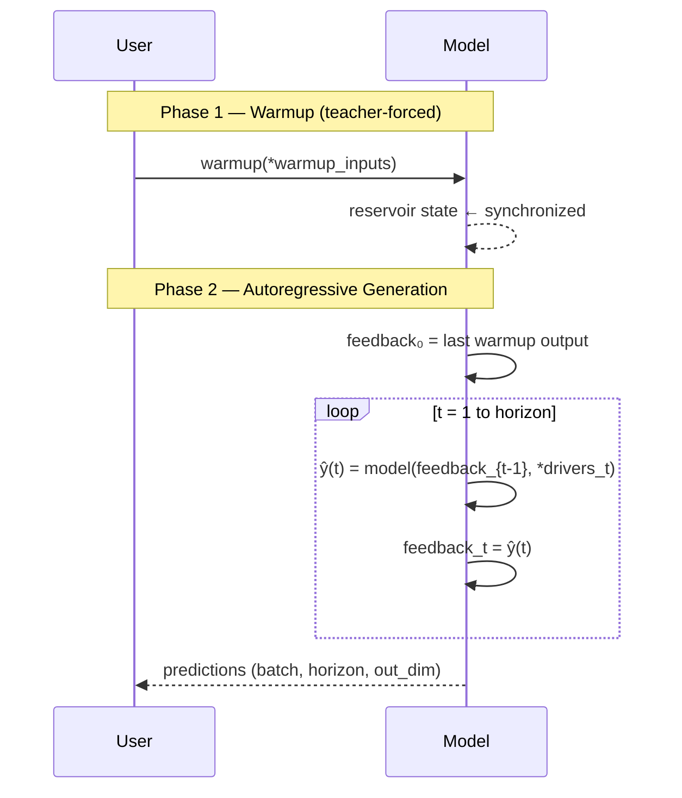

# Forecasting

After training, `model.forecast()` generates multi-step-ahead predictions using an autoregressive closed-loop strategy.

---

## How Forecasting Works

Forecasting has two phases:



---

## Basic Forecasting

```python
# Feedback-only model
predictions = model.forecast(warmup_data, horizon=1000)
# → (batch, 1000, out_dim)
```

---

## With Driving Inputs

For models that take exogenous drivers, you must provide:
1. Warmup drivers (aligned with warmup feedback)
2. Future drivers for the forecast horizon

```python
predictions = model.forecast(
    warmup_feedback,            # (batch, warmup_steps, 3)
    warmup_driver,              # (batch, warmup_steps, 5)
    horizon=500,
    forecast_drivers=(future_driver,),  # (batch, 500, 5)
)
```

!!! warning "Forecast drivers must span the full horizon"
    Each tensor in `forecast_drivers` must have shape `(batch, horizon, feat)`.
    If your model has multiple driving inputs, provide all of them in the correct order.

---

## Including Warmup in Output

To get a continuous trajectory (warmup predictions + forecast):

```python
full_output = model.forecast(warmup_data, horizon=1000, return_warmup=True)
# shape: (batch, warmup_steps + 1 + horizon, out_dim)
# The "+1" accounts for the first autoregressive step that uses the last warmup state
```

---

## Custom Initial Feedback

By default, the initial autoregressive feedback is the model's last warmup prediction. Override:

```python
initial_fb = torch.tensor([[[0.5, -0.3, 1.2]]])   # (1, 1, out_dim)
predictions = model.forecast(
    warmup_data,
    horizon=200,
    initial_feedback=initial_fb,
)
```

---

## Batch Forecasting

Forecast multiple sequences in parallel (they share model weights but have independent states):

```python
batch_warmup = torch.stack([warmup_1, warmup_2, warmup_3], dim=0)  # (3, warmup_steps, feat)
predictions = model.forecast(batch_warmup, horizon=100)             # (3, 100, feat)
```

---

## Multi-Output Models

For models with multiple outputs, `forecast()` uses the **first output** as the autoregressive feedback:

```python
# Model with 2 outputs: (position, velocity)
pos_readout = CGReadoutLayer(500, 3, name="position")(res)
vel_readout = CGReadoutLayer(500, 3, name="velocity")(res)
model = ESNModel(inp, [pos_readout, vel_readout])

# model.forecast() uses position (first output, dim=3) as feedback
predictions = model.forecast(warmup, horizon=500)
# Returns list: [position_preds (batch,500,3), velocity_preds (batch,500,3)]
```

!!! important "Feedback dimension constraint"
    The **first model output** dimension must match the **feedback input** dimension.
    If `feedback_size=3`, the first output must be 3-dimensional.

---

## Long-Horizon Forecasting

For chaotic systems, forecast quality degrades over time (bounded by Lyapunov time). resdag handles arbitrarily long horizons efficiently:

```python
# Horizon 10,000 — processes one step at a time, GPU-efficient
preds = model.forecast(warmup, horizon=10_000)
print(preds.shape)  # (batch, 10000, 3)
```

---

## State Management Around Forecasting

```python
# Save state after warmup for repeated forecasts from same initial condition
model.warmup(warmup_data)
states = model.get_reservoir_states()

for horizon in [100, 500, 1000]:
    model.set_reservoir_states(states)  # restore warmup state
    preds = model.forecast(
        warmup_data,   # warmup again from same checkpoint
        horizon=horizon,
    )
    print(f"Horizon {horizon}: MSE = {compute_mse(preds, truth):.4f}")
```

---

## Stacked Reservoir Forecasting

For models with multiple chained reservoirs:

```python
inp  = ps.Input((100, 1))
res1 = ESNLayer(50, feedback_size=1)(inp)
res2 = ESNLayer(60, feedback_size=50)(res1)   # res1 output as feedback
out  = CGReadoutLayer(60, 1, name="output")(res2)
model = ESNModel(inp, out)

# All reservoirs are handled automatically
preds = model.forecast(warmup, horizon=200)

# Inspect states of all reservoirs
states = model.get_reservoir_states()
for name, state in states.items():
    print(f"{name}: {state.shape}")
```

---

## Forecast Quality Metrics

### RMSE

```python
rmse = torch.sqrt(torch.mean((preds - truth) ** 2))
```

### Valid Horizon (contiguous correct steps)

```python
threshold = 0.4  # normalized error threshold
errors = torch.sqrt(torch.mean((preds - truth) ** 2, dim=-1))  # (batch, horizon)
valid = (errors < threshold).all(dim=0)                         # (horizon,)
horizon_length = valid.cumsum(0).argmax()
print(f"Valid horizon: {horizon_length.item()} steps")
```

### Lyapunov Time

For the Lorenz system, the Lyapunov time is approximately `1/0.906 ≈ 1.1` (in units of the integration time step). Valid forecast horizon measured in Lyapunov times is the standard chaotic system benchmark.

---

## Example: Complete Forecast Pipeline

```python
import torch
from resdag.models import ott_esn
from resdag.training import ESNTrainer

# --- Data (Lorenz-like) ---
torch.manual_seed(42)
data    = torch.randn(1, 10000, 3).cumsum(dim=1) * 0.1
warmup  = data[:, :500,   :]
train   = data[:, 500:3000, :]
target  = data[:, 501:3001, :]
f_warm  = data[:, 3000:3500, :]
val     = data[:, 3500:4500, :]

# --- Build and train ---
model   = ott_esn(reservoir_size=300, feedback_size=3, output_size=3)
trainer = ESNTrainer(model)
trainer.fit(
    warmup_inputs=(warmup,),
    train_inputs=(train,),
    targets={"output": target},
)

# --- Forecast ---
preds   = model.forecast(f_warm, horizon=1000)
rmse    = torch.sqrt(torch.mean((preds - val) ** 2)).item()
print(f"Forecast RMSE: {rmse:.4f}")

# --- With return_warmup for visualization ---
full    = model.forecast(f_warm, horizon=1000, return_warmup=True)
# full shape: (1, 500 + 1 + 1000, 3)
```
