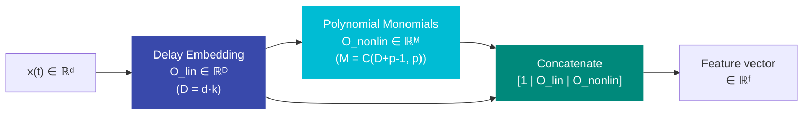

# Next Generation Reservoir Computing (NG-RC)

NG-RC ([Gauthier et al., 2021](https://www.nature.com/articles/s41467-021-25801-2)) is a reservoir computing variant that replaces recurrent weights entirely with a deterministic feature map: **time-delayed polynomial embeddings**.

---

## Overview

Unlike traditional ESNs, NG-RC requires **no recurrent weight matrix** and has **no learnable parameters** in the reservoir. It constructs features by:

1. Stacking delayed copies of the input (delay embedding)
2. Computing all degree-\(p\) polynomial monomials of the embedded vector



**Feature dimension**:

\[
f = \underbrace{1}_{\text{const}} + \underbrace{D}_{\text{linear}} + \underbrace{\binom{D+p-1}{p}}_{\text{nonlinear}}
\]

where \(D = d \cdot k\) (input dimension × delay taps).

---

## Quick Reference

```python
from resdag.layers import NGReservoir

layer = NGReservoir(
    input_dim=3,              # (1) dimension of each input vector
    k=2,                      # (2) number of delay taps (including current)
    s=1,                      # (3) spacing between taps (timesteps)
    p=2,                      # (4) polynomial degree for monomials
    include_constant=True,    # (5) prepend 1.0 to feature vector
    include_linear=True,      # (6) include linear delay-embedded features
)

x = torch.randn(4, 100, 3)   # (batch, seq_len, input_dim)
features = layer(x)           # (4, 100, feature_dim)
print(layer.feature_dim)      # inspect total feature count
```

---

## Parameters

### `input_dim` · `int`
Dimensionality of each input vector at a single timestep.

### `k` · `int` · default `2`
Number of delay taps, including the current input. With `k=2` and `s=1`, the embedding is `[x(t), x(t-1)]`. With `k=1`, there is no delay buffer (the state is empty).

### `s` · `int` · default `1`
Spacing between taps in timesteps. With `k=3, s=2`, the embedding uses `[x(t), x(t-2), x(t-4)]`.

### `p` · `int` · default `2`
Polynomial degree. All monomials of degree ≤ `p` are computed from the delay-embedded vector. Higher `p` adds exponentially more features.

### `include_constant` · `bool` · default `True`
Prepend a constant `1.0` feature. Required for affine readouts without separate bias.

### `include_linear` · `bool` · default `True`
Include the linear delay-embedded features `O_lin` in the output. If `False`, only nonlinear monomials are returned (useful for odd-symmetry configurations).

---

## Feature Dimension Table

For `input_dim=3`, `include_constant=True`, `include_linear=True`:

| k | s | p | D | f |
|---|---|---|---|---|
| 1 | 1 | 2 | 3 | 1 + 3 + 6 = **10** |
| 2 | 1 | 2 | 6 | 1 + 6 + 28 = **35** |
| 2 | 1 | 3 | 6 | 1 + 6 + 84 = **91** |
| 3 | 1 | 2 | 9 | 1 + 9 + 55 = **65** |
| 4 | 2 | 2 | 12 | 1 + 12 + 91 = **104** |

!!! warning "Combinatorial Explosion"
    The monomial count \(\binom{D+p-1}{p}\) grows rapidly. resdag emits a warning when
    `feature_dim > 10,000`. For large systems, keep `k` and `p` small, or use an ESN instead.

---

## State: The Delay Buffer

Unlike ESN's `(batch, reservoir_size)` 2D state, the NG-RC state is a **3D FIFO delay buffer**:

```
state shape: (batch, (k-1)*s, input_dim)
```

- When `k=1`: no buffer needed (`state_size = 0`)
- Buffer fills causally: earlier outputs contain zeros from unfilled slots

```python
layer = NGReservoir(input_dim=3, k=3, s=2)
print(layer.warmup_length)  # (3-1)*2 = 4 steps to fill buffer

x = torch.randn(1, 100, 3)
features = layer(x)
# features[:, :4, :] contain features from partially filled buffer
# features[:, 4:, :] are fully reliable
valid_features = features[:, layer.warmup_length:, :]
```

State management:

```python
layer.reset_state()                  # discard buffer
layer.reset_state(batch_size=4)      # reset to zeros, explicit batch
state = layer.get_state()            # (batch, state_size, input_dim)
layer.set_state(buffer_tensor)       # restore saved state (shape validated)
```

---

## Examples

### Basic Usage

```python
import torch
from resdag.layers import NGReservoir
from resdag.layers.readouts import CGReadoutLayer

# Create NG-RC feature extractor
layer = NGReservoir(input_dim=3, k=2, s=1, p=2)
print(f"Feature dim: {layer.feature_dim}")  # 35

# Process a sequence
x = torch.randn(4, 100, 3)
features = layer(x)           # (4, 100, 35)

# Feed to a readout (train separately via ESNTrainer)
readout = CGReadoutLayer(layer.feature_dim, 3, alpha=1e-6, name="output")
output = readout(features)    # (4, 100, 3)
```

### Full NG-RC Model with ESNModel

```python
import pytorch_symbolic as ps
from resdag import ESNModel
from resdag.layers import NGReservoir, CGReadoutLayer

inp  = ps.Input((100, 3))
feat = NGReservoir(input_dim=3, k=2, p=2)(inp)
out  = CGReadoutLayer(35, 3, name="output")(feat)
model = ESNModel(inp, out)

# Train as usual
from resdag.training import ESNTrainer
trainer = ESNTrainer(model)
trainer.fit(
    warmup_inputs=(warmup,),
    train_inputs=(train,),
    targets={"output": target},
)
```

### Double-Scroll Configuration (Odd Symmetry)

For systems with odd symmetry (e.g., Lorenz attractor), the nonlinear-only configuration (no linear, no constant) respects the symmetry:

```python
layer = NGReservoir(
    input_dim=3,
    k=2,
    s=1,
    p=3,                    # degree-3 monomials
    include_constant=False, # no constant term
    include_linear=False,   # no linear features
)
```

---

## Comparison: ESN vs NG-RC

| Property | ESN | NG-RC |
|---|---|---|
| Weights | Random, fixed | None |
| State | Recurrent hidden state | FIFO delay buffer |
| Warmup | Echo State Property | Buffer fill time |
| Hyperparams | Spectral radius, leak rate, topology, initializer | k, s, p |
| Expressivity | Grows with reservoir size | Grows polynomially with k, p |
| Reproducibility | Stochastic (random init) | Deterministic |
| Best for | High-dim, noisy, diverse systems | Low-dim, clean, chaotic systems |

---

## API Reference

::: resdag.layers.NGReservoir
    options:
      show_root_heading: true
      show_source: false
