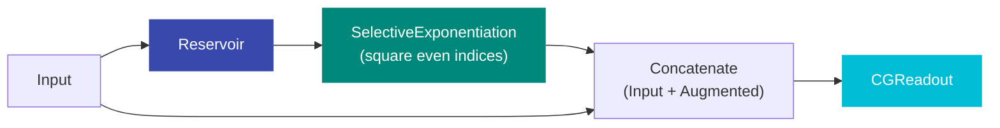
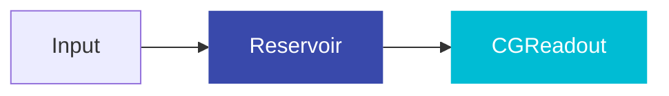
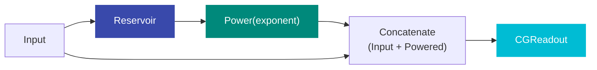
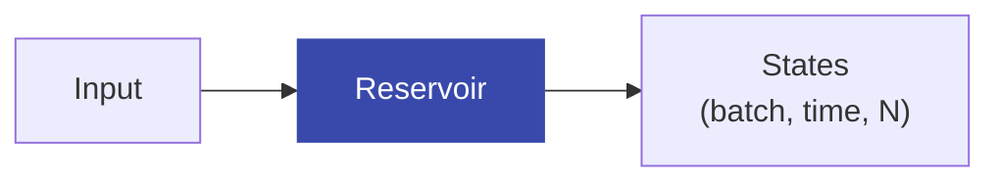

# Premade Models

resdag ships with factory functions for common ESN architectures. Each returns a fully configured `ESNModel` ready for training.

```python
from resdag.models import ott_esn, classic_esn, headless_esn, linear_esn, power_augmented
```

---

## ott_esn — Recommended for Chaotic Systems

`ott_esn` implements the architecture from **Ott et al. (2018)** for predicting spatiotemporally chaotic systems. The key innovation is **state augmentation**: even-indexed reservoir neurons are squared before the readout. This helps capture higher-order dynamics in chaotic attractors.

**Architecture:**



```python
from resdag.models import ott_esn

model = ott_esn(
    reservoir_size=500,        # number of reservoir neurons
    feedback_size=3,           # input/output dimension
    output_size=3,             # output dimension (usually = feedback_size)
    # Optional reservoir params
    topology=None,             # topology spec (see Topologies)
    spectral_radius=0.9,       # spectral radius
    leak_rate=1.0,             # leaky integration
    feedback_initializer=None, # feedback weight init
    activation="tanh",         # activation function
    bias=True,
    trainable=False,
    # Optional readout params
    readout_alpha=1e-6,        # ridge regularization
    readout_bias=True,
    readout_name="output",     # must match targets dict key
)
```

### Why State Augmentation?

The Lorenz attractor and similar systems have dynamics that include both odd and even symmetry components. By squaring even-indexed neurons:

- The readout can access quadratic features without extra layers
- The model can represent both linear and quadratic dependencies
- The augmented state \([x, x^2_{\text{even}}]\) is a better feature basis for the readout

---

## classic_esn — Simple Baseline

`classic_esn` is the standard ESN: reservoir → linear readout. No augmentation.



```python
from resdag.models import classic_esn

model = classic_esn(
    reservoir_size=500,
    feedback_size=3,
    output_size=3,
    spectral_radius=0.9,
    topology=None,
    leak_rate=1.0,
    feedback_initializer=None,
    activation="tanh",
    readout_alpha=1e-6,
    readout_name="output",
)
```

**Best for**: Simple time series, baselines, ablation studies.

---

## power_augmented — Generalized State Augmentation

`power_augmented` generalizes `ott_esn` by raising **all** reservoir neurons to an arbitrary power (not just squaring even-indexed ones).



```python
from resdag.models import power_augmented

model = power_augmented(
    reservoir_size=500,
    feedback_size=3,
    output_size=3,
    exponent=2.0,      # power to raise states to (2.0 = square)
    spectral_radius=0.9,
    readout_alpha=1e-6,
)
```

**Best for**: When you want to experiment with different augmentation degrees.

---

## headless_esn — Reservoir States Only

`headless_esn` returns the raw reservoir states without any readout. Useful for:
- Analysis and visualization of reservoir dynamics
- Using the reservoir as a feature extractor before applying your own model



```python
from resdag.models import headless_esn

model = headless_esn(
    reservoir_size=500,
    feedback_size=3,
    spectral_radius=0.9,
    topology=None,
    leak_rate=1.0,
    feedback_initializer=None,
    activation="tanh",
)

# No readout — returns reservoir states directly
states = model(input_data)   # (batch, time, 500)
```

**Note**: Cannot be directly trained with `ESNTrainer` (no readout to fit). Use for analysis or add your own readout.

---

## linear_esn — Linear Readout (nn.Linear)

`linear_esn` uses a standard `nn.Linear` instead of `CGReadoutLayer`. The readout is trained with gradient descent, not ridge regression.

```python
from resdag.models import linear_esn

model = linear_esn(
    reservoir_size=500,
    feedback_size=3,
    output_size=3,
    spectral_radius=0.9,
)

# Train with standard PyTorch optimizer
optimizer = torch.optim.Adam(model.parameters(), lr=1e-3)
for epoch in range(100):
    pred = model(train_data)
    loss = F.mse_loss(pred, targets)
    loss.backward()
    optimizer.step()
    optimizer.zero_grad()
```

**Best for**: When you want gradient-based readout training (unusual for ESNs).

---

## Architecture Comparison

| Model | Augmentation | Readout Type | Training |
|---|---|---|---|
| `ott_esn` | Square even-indexed neurons + concat input | CG ridge | Algebraic |
| `power_augmented` | Power all neurons + concat input | CG ridge | Algebraic |
| `classic_esn` | None | CG ridge | Algebraic |
| `headless_esn` | None | None | N/A |
| `linear_esn` | None | `nn.Linear` | Gradient descent |

---

## Common Patterns

### Lorenz / Rössler (3D chaos)

```python
model = ott_esn(
    reservoir_size=500,
    feedback_size=3,
    output_size=3,
    spectral_radius=0.9,
    topology="erdos_renyi",
)
```

### High-dimensional chaos (KS equation, etc.)

```python
model = ott_esn(
    reservoir_size=2000,
    feedback_size=64,
    output_size=64,
    spectral_radius=0.95,
    topology=("watts_strogatz", {"k": 6, "p": 0.1}),
    feedback_initializer=("pseudo_diagonal", {"input_scaling": 0.5}),
)
```

### Input-driven system

```python
# Use the composition API for input-driven models
import pytorch_symbolic as ps
from resdag import ESNModel, ESNLayer, CGReadoutLayer

feedback = ps.Input((100, 3))
driver   = ps.Input((100, 5))
res      = ESNLayer(500, feedback_size=3, input_size=5)(feedback, driver)
out      = CGReadoutLayer(500, 3, name="output")(res)
model    = ESNModel([feedback, driver], out)
```

---

## API Reference

::: resdag.models.ott_esn
    options:
      show_root_heading: true
      show_source: false

::: resdag.models.classic_esn
    options:
      show_root_heading: true
      show_source: false

::: resdag.models.power_augmented
    options:
      show_root_heading: true
      show_source: false

::: resdag.models.headless_esn
    options:
      show_root_heading: true
      show_source: false
