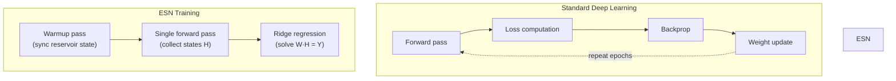

# Training

`ESNTrainer` orchestrates the two-phase ESN training workflow: reservoir synchronization (warmup) followed by algebraic readout fitting.

---

## Training Philosophy

ESN training differs fundamentally from gradient-based deep learning:



The key insight: since the reservoir weights are fixed, we only need to solve a linear system — once.

---

## ESNTrainer

```python
from resdag.training import ESNTrainer

trainer = ESNTrainer(model)
trainer.fit(
    warmup_inputs=(warmup_feedback,),       # state synchronization
    train_inputs=(train_feedback,),          # readout training data
    targets={"output": train_targets},       # ground truth
)
```

### The `fit()` Method

```python
trainer.fit(
    warmup_inputs: tuple[Tensor, ...],
    train_inputs:  tuple[Tensor, ...],
    targets:       dict[str, Tensor],
)
```

**Parameters**

| Parameter | Type | Description |
|---|---|---|
| `warmup_inputs` | `tuple[Tensor, ...]` | Warmup sequences — `(feedback, driver1, ...)`. Shape: `(batch, warmup_steps, feat)` |
| `train_inputs` | `tuple[Tensor, ...]` | Training sequences. Same format as `warmup_inputs`. Shape: `(batch, train_steps, feat)` |
| `targets` | `dict[str, Tensor]` | Mapping readout name → target tensor. Shape: `(batch, train_steps, out_features)` |

---

## Step-by-Step Breakdown

### Step 1: Reservoir Reset

```python
self.model.reset_reservoirs()
```

All reservoir states are reset to `None`. On the first forward call they will be lazily re-initialized to zeros.

### Step 2: Warmup Phase

```python
self.model.warmup(*warmup_inputs)
```

Runs a teacher-forced forward pass through `warmup_inputs`. The reservoir state converges toward the attractor of the input dynamics, shedding memory of the arbitrary initial state. This exploits the Echo State Property.

!!! tip "How long should warmup be?"
    A good rule of thumb: warmup length ≥ the effective memory of the reservoir. For spectral radius near 1, this can be hundreds of timesteps. For chaotic systems, 500–2000 steps is typical.

### Step 3: Readout Fitting

A single forward pass through `train_inputs` is performed. Just before each readout layer processes its input, a pre-hook intercepts the data and calls `readout.fit(states, targets[name])`. Readouts are processed in topological order, so multi-readout models work correctly.

```python
# Conceptually what the pre-hook does:
readout.fit(reservoir_states, targets["output"])  # solves ridge regression
output = readout(reservoir_states)                # produces predictions
```

After `fit()` completes, `readout.is_fitted == True` and the model is ready for inference.

---

## Input Conventions

### Feedback-Only Model

```python
# Model created with a single input
inp = ps.Input((100, feedback_size))
reservoir = ESNLayer(N, feedback_size=feedback_size)(inp)
...

# Training: single-element tuples
trainer.fit(
    warmup_inputs=(warmup_feedback,),
    train_inputs=(train_feedback,),
    targets={"output": targets},
)
```

### Input-Driven Model

```python
# Model created with two inputs
feedback_inp = ps.Input((100, 3))
driver_inp   = ps.Input((100, 5))
reservoir = ESNLayer(N, feedback_size=3, input_size=5)(feedback_inp, driver_inp)
...

# Training: multi-element tuples; order must match model inputs
trainer.fit(
    warmup_inputs=(warmup_feedback, warmup_driver),
    train_inputs=(train_feedback, train_driver),
    targets={"output": targets},
)
```

!!! important "Tuple ordering"
    The order of tensors in `warmup_inputs` and `train_inputs` must match the order of model inputs.
    The first element is always the **feedback** (model output dimension), followed by any drivers.

---

## Multi-Readout Training

When the model has multiple readouts, provide all target keys:

```python
# Multi-output model
reservoir = ESNLayer(500, feedback_size=3)(inp)
r_pos = CGReadoutLayer(500, 3, name="position")(reservoir)
r_vel = CGReadoutLayer(500, 3, name="velocity")(reservoir)
model = ESNModel(inp, [r_pos, r_vel])

# Training — all readouts must appear in targets
trainer.fit(
    warmup_inputs=(warmup,),
    train_inputs=(train,),
    targets={
        "position": position_targets,  # (batch, train_steps, 3)
        "velocity": velocity_targets,  # (batch, train_steps, 3)
    },
)
```

!!! note "Topological order"
    For cascaded readouts (where one readout feeds another), `ESNTrainer` automatically
    processes them in topological order using the model's execution graph.

---

## Target Alignment

Training inputs and targets must be **time-aligned**:

```python
# Correct: one-step-ahead prediction
# data[t] → target[t+1]
train_data   = data[:, :-1, :]   # inputs at t=0..T-1
train_target = data[:, 1:, :]    # targets at t=1..T

trainer.fit(
    warmup_inputs=(warmup,),
    train_inputs=(train_data,),
    targets={"output": train_target},
)
```

The validator raises `ValueError` if `train_inputs` and `targets` have different sequence lengths.

---

## Error Handling

`ESNTrainer.fit()` validates inputs and raises informative errors:

```python
# Missing target key
trainer.fit(..., targets={})
# ValueError: Missing targets for readouts: ['output']. Available readouts: ['output']. ...

# Length mismatch
trainer.fit(
    warmup_inputs=(warmup,),
    train_inputs=(train_1000,),
    targets={"output": target_500},  # different length!
)
# ValueError: Target for 'output' has 500 timesteps, but train_inputs has 1000 timesteps.

# Mismatched input tuple sizes
trainer.fit(
    warmup_inputs=(warmup_fb, warmup_driver),
    train_inputs=(train_fb,),  # missing driver!
)
# ValueError: warmup_inputs has 2 tensors, but train_inputs has 1 tensors. Must match.
```

---

## Complete Example

```python
import torch
import pytorch_symbolic as ps
from resdag import ESNModel, ESNLayer, CGReadoutLayer, ESNTrainer

torch.manual_seed(42)

# --- Data ---
N_steps = 3000
data = torch.cumsum(torch.randn(1, N_steps, 3) * 0.1, dim=1)
warmup = data[:, :200,   :]
train  = data[:, 200:1200, :]
target = data[:, 201:1201, :]
f_warm = data[:, 1200:1400, :]
val    = data[:, 1400:1600, :]

# --- Model ---
inp      = ps.Input((100, 3))
reservoir = ESNLayer(300, feedback_size=3, spectral_radius=0.95)(inp)
readout  = CGReadoutLayer(300, 3, alpha=1e-6, name="output")(reservoir)
model    = ESNModel(inp, readout)

# --- Train ---
trainer = ESNTrainer(model)
trainer.fit(
    warmup_inputs=(warmup,),
    train_inputs=(train,),
    targets={"output": target},
)

# --- Evaluate ---
preds = model.forecast(f_warm, horizon=200)
mse = torch.mean((preds - val) ** 2).item()
print(f"Validation MSE: {mse:.6f}")
```

---

## API Reference

::: resdag.training.ESNTrainer
    options:
      show_root_heading: true
      show_source: false
