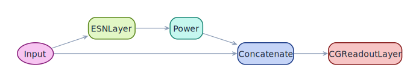
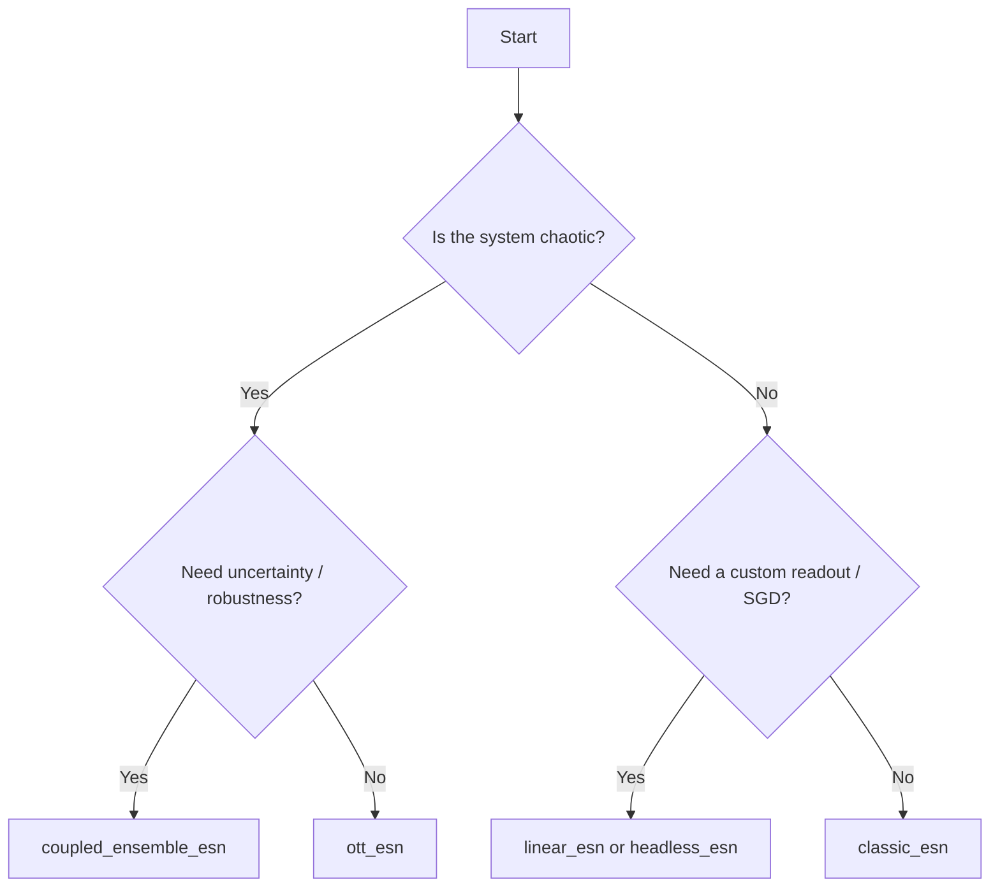

# Built-in models

ResDAG ships with six premade architectures. Each is a factory function
that returns a configured [`ESNModel`](../reference/core.md) ready to
train. Picking one is the fastest path from "I have data" to "I have a
forecast"; you can always graduate to the [functional API](functional-api.md)
once you need a topology no factory provides.

| Factory | Architecture | Recommended for |
|---|---|---|
| [`classic_esn`](#classic_esn) | input → reservoir → concat → readout | Most baseline tasks. The right default. |
| [`ott_esn`](#ott_esn) | input → reservoir → square-even → concat → readout | Chaotic and bidirectional systems. |
| [`power_augmented`](#power_augmented) | input → reservoir → pow(·) → concat → readout | When `ott_esn`'s squaring is the wrong exponent. |
| [`linear_esn`](#linear_esn) | input → reservoir → linear readout (`torch.nn.Linear`) | When you'll fit the readout with SGD or want a trainable bias. |
| [`headless_esn`](#headless_esn) | input → reservoir | Reservoir as a feature extractor inside a larger pipeline. |
| [`coupled_ensemble_esn`](#coupled_ensemble_esn) | N parallel ESNs with shared feedback | Chaotic forecasting, robustness, uncertainty quantification. |

All six share the same parameter conventions: `reservoir_size`,
`feedback_size`, `output_size`, plus reservoir knobs (`spectral_radius`,
`leak_rate`, `topology`, `feedback_initializer`, `activation`,
`trainable`) and readout knobs (`readout_alpha`, `readout_bias`,
`readout_name`). Anything else gets forwarded into `ESNLayer` via
`**reservoir_kwargs`.

---

## `classic_esn`

The textbook architecture: the input bypasses the reservoir and is
concatenated with the reservoir state before the linear readout sees
either.

<figure markdown>
  { width="720" }
</figure>

```python
from resdag import classic_esn

model = classic_esn(
    reservoir_size=400,
    feedback_size=3,
    output_size=3,
    spectral_radius=0.9,
    topology="erdos_renyi",
    feedback_initializer="random",
)
```

**Use when** the dynamics are smooth and roughly periodic, or as a
baseline to compare more elaborate factories against. The skip
connection from input to readout means the model degrades gracefully
to a linear predictor when the reservoir contributes little signal.

---

## `ott_esn`

Ott's state-augmented ESN (Pathak et al., 2018). The reservoir state is
transformed by `SelectiveExponentiation(index=0, exponent=2.0)` —
even-indexed units are squared — before being concatenated with the
input. The squaring breaks the parity symmetry of `tanh`, which is
important for systems like Lorenz-63 where the dynamics are not
invariant under sign flips.

<figure markdown>
  { width="720" }
</figure>

```python
from resdag import ott_esn

model = ott_esn(
    reservoir_size=1_500,
    feedback_size=3,
    output_size=3,
    spectral_radius=1.0,
    leak_rate=1.0,
    readout_alpha=1e-7,
)
```

**Use when** you forecast chaotic or asymmetric systems. This is the
recommended starting point for the
[Lorenz walkthrough](../getting-started/lorenz-walkthrough.md).

---

## `power_augmented`

Generalises Ott's state augmentation with a configurable exponent
applied to **all** reservoir units (not just even-indexed ones).

<figure markdown>
  { width="720" }
</figure>

```python
from resdag import power_augmented

model = power_augmented(
    reservoir_size=600,
    feedback_size=3,
    output_size=3,
    exponent=2.0,        # square every unit
    spectral_radius=0.95,
)
```

**Use when** Ott's specific even-only-squaring isn't quite right.
`exponent=2` gives a uniform-symmetry analogue; `exponent=3` preserves
sign but emphasises large amplitudes; non-integer exponents are useful
when the target dynamics live on a power law.

---

## `linear_esn`

Same reservoir, but the readout is a plain `torch.nn.Linear` (no
`CGReadoutLayer`). You fit it however you like — SGD, Adam, your own
solver — making this the right factory for hybrid pipelines that mix
algebraic and gradient training.

```python
from resdag import linear_esn

model = linear_esn(
    reservoir_size=400,
    feedback_size=2,
    output_size=1,
    spectral_radius=0.9,
)
# Train with any torch.nn.Module workflow.
```

**Use when** you want the readout to participate in
backpropagation — e.g. plugging an ESN into a larger network that's
optimised end-to-end with Adam.

---

## `headless_esn`

Just the reservoir, no readout. You wire whatever downstream module you
like onto its output yourself.

```python
from resdag import headless_esn

model = headless_esn(
    reservoir_size=400,
    feedback_size=3,
    spectral_radius=0.9,
)
states = model(x)        # (batch, time, reservoir_size)
```

**Use when** the reservoir is a feature extractor and the rest of the
pipeline lives outside ResDAG — a classifier, a torch RNN head, a
diffusion-style score model, anything. See the
[pipeline integration example](../examples/pipeline-integration.md).

---

## `coupled_ensemble_esn`

N independent sub-models trained on identical data, then forecast
autoregressively while sharing a **single aggregated feedback** between
them. Each sub-model is a complete `ESNModel` (defaulting to `ott_esn`,
but any factory works) and diversity comes from independent random
reservoir initialisation.

```python
from resdag import coupled_ensemble_esn
from resdag.ensemble.aggregators import OutliersFilteredMean

ensemble = coupled_ensemble_esn(
    n_models=5,
    reservoir_size=600,
    feedback_size=3,
    output_size=3,
    spectral_radius=1.0,
    aggregate="mean",                # or "median", or a Module
    seed=0,                          # reproducible sub-model init
)
ensemble.fit(
    warmup_inputs=(warmup,),
    train_inputs=(train,),
    targets={"output": target},
    n_workers=2,                     # CPU-parallel ridge solves
)
pred, individuals = ensemble.forecast(
    f_warmup, horizon=val.shape[1], return_individuals=True,
)
```

**Use when** you want either (i) a more stable forecast than any single
seed gives, or (ii) explicit uncertainty quantification — the spread of
`individuals` is the ensemble's epistemic uncertainty.

See the [coupled ensembles guide](coupled-ensembles.md) and the
[ensemble example](../examples/ensemble.md) for full workflows.

---

## Which to pick?



Then if a factory ever feels constraining — multiple inputs, deep
parallel reservoirs, skip connections — drop down to the
[functional API](functional-api.md). Every factory above is itself a
functional-API build under the hood; nothing magical.
