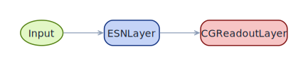
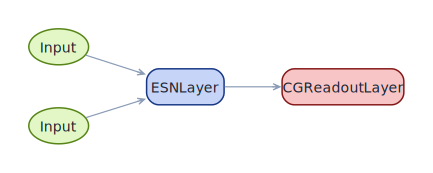
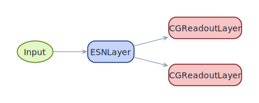
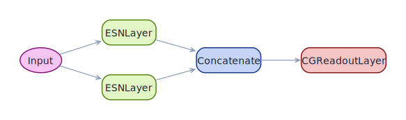
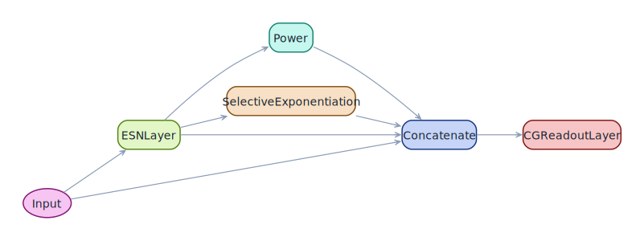

# Functional API — build your own architecture

Every premade factory in ResDAG is really three calls to
`pytorch_symbolic`: declare an input, route it through some layers,
wrap the result in `ESNModel`. Once you see that pattern, the
[built-in models](builtin-models.md) become starting points instead of
constraints — and you can build arbitrary DAGs.

This page walks **simple → complex** through five canonical patterns.

## The pattern

```python
import pytorch_symbolic as ps
from resdag import ESNModel, reservoir_input
from resdag.layers import ESNLayer, CGReadoutLayer

inp = reservoir_input(feature_size)         # 1. symbolic input
out = some_layer_chain(inp)                 # 2. functional composition
model = ESNModel(inp, out)                  # 3. wrap into an ESNModel
```

`reservoir_input(feature_size)` is shorthand for
`ps.Input((1, feature_size))`; the time dimension is a placeholder. Each
layer in step 2 is called on the symbolic tensor it consumes, returning
a new symbolic tensor. `ESNModel` traces the resulting graph into a
`torch.nn.Module`.

## 1 — Minimal: a single reservoir

```python
from resdag import ESNModel, reservoir_input
from resdag.layers import ESNLayer, CGReadoutLayer

inp = reservoir_input(1)
states = ESNLayer(reservoir_size=100, feedback_size=1)(inp)
out = CGReadoutLayer(in_features=100, out_features=1, name="output")(states)

model = ESNModel(inp, out)
```

<figure markdown>
  { width="540" }
  <figcaption>The simplest possible ResDAG model: one reservoir, one
  readout, one signal in and out.</figcaption>
</figure>

## 2 — Input-driven: feedback + exogenous driver

When the system you forecast has an external forcing signal — control
inputs, weather drivers, exogenous variables — feed the reservoir from
*two* symbolic inputs. The first is feedback (the channel the model
predicts and reads back during autoregression); the rest are drivers
that ride alongside.

```python
feedback = reservoir_input(3)
driver   = reservoir_input(2)

states = ESNLayer(
    reservoir_size=300,
    feedback_size=3,
    input_size=2,
)(feedback, driver)
out = CGReadoutLayer(300, 3, name="output")(states)

model = ESNModel([feedback, driver], out)
```

<figure markdown>
  { width="720" }
  <figcaption>Two inputs feeding one reservoir. <code>feedback</code> is
  the channel the model autoregresses on; <code>driver</code> rides
  alongside.</figcaption>
</figure>

During [`forecast`](../reference/core.md), pass future driver values
through `forecast_inputs=(future_driver,)` so the autoregressive loop
knows what the external forcing will be.

## 3 — Multi-readout: one reservoir, several heads

The reservoir runs once; multiple `CGReadoutLayer`s regress against
different targets in parallel. The `ESNTrainer` fits all of them in one
call.

```python
inp = reservoir_input(3)
states = ESNLayer(reservoir_size=400, feedback_size=3)(inp)

head_pos = CGReadoutLayer(400, 3, name="position")(states)
head_vel = CGReadoutLayer(400, 3, name="velocity")(states)

model = ESNModel(inp, [head_pos, head_vel])

trainer.fit(
    warmup_inputs=(warmup,),
    train_inputs=(train,),
    targets={"position": pos_targets, "velocity": vel_targets},
)
```

<figure markdown>
  { width="720" }
  <figcaption>Shared reservoir, two readouts trained against different
  targets. Each readout's name matches the key in
  <code>trainer.fit(targets=...)</code>.</figcaption>
</figure>

The first listed output is the one used for autoregression in
`forecast`. Order matters when you mix multi-head with chaotic
forecasting.

## 4 — Parallel reservoirs: multi-timescale dynamics

Two reservoirs with *different* dynamical regimes — a "fast" one with
low spectral radius and high leak, a "slow" one tuned for long memory.
Their outputs concatenate before the readout, which learns to combine
them.

```python
from resdag.layers import Concatenate

inp = reservoir_input(3)
fast = ESNLayer(200, feedback_size=3, spectral_radius=0.6, leak_rate=1.0)(inp)
slow = ESNLayer(200, feedback_size=3, spectral_radius=0.95, leak_rate=0.3)(inp)

merged = Concatenate()(fast, slow)
out = CGReadoutLayer(in_features=400, out_features=3, name="output")(merged)
model = ESNModel(inp, out)
```

<figure markdown>
  { width="720" }
  <figcaption>Two reservoirs with different time constants run in
  parallel; the readout sees a 400-dim concatenation of both
  states.</figcaption>
</figure>

Works well on systems with mixed timescales (slow drift + fast
oscillations) and is the structural inspiration behind
hierarchical-reservoir literature.

## 5 — Augmentation stack: input + reservoir + nonlinear features

Build an augmented feature space by stacking transforms on the
reservoir's output, then concatenate everything (skip-style) before the
readout.

```python
from resdag.layers import Power, SelectiveExponentiation

inp = reservoir_input(3)
res = ESNLayer(reservoir_size=400, feedback_size=3)(inp)

square_all  = Power(exponent=2.0)(res)
cube_odd    = SelectiveExponentiation(index=1, exponent=3.0)(res)

merged = Concatenate()(inp, res, square_all, cube_odd)
out = CGReadoutLayer(merged.shape[-1], 3, name="output")(merged)
model = ESNModel(inp, out)
```

<figure markdown>
  { width="720" }
  <figcaption>The readout sees four feature streams: the raw input, the
  reservoir state, an all-units squared variant, and an odd-units cubed
  variant. The factory <code>power_augmented</code> is a one-knob
  version of this idea.</figcaption>
</figure>

The pattern composes: deeper augmentation stacks, multi-stage
augmentations, and entirely custom transforms are just more nodes in
the graph.

---

## Working with the graph you built

Once you have an `ESNModel`, every operation in the library applies
uniformly:

```python
model.summary()                  # text table of every node
model.plot_model()               # graphviz DAG (Jupyter inline or saved)
model.save("custom_arch.pt")     # weights + optionally reservoir states
ESNTrainer(model).fit(...)       # algebraic fit of all readouts in one pass
model.forecast(warmup, horizon=N)
```

See the [visualizing architectures guide](visualizing-architectures.md)
for a side-by-side gallery of the architectures above and the
[custom-model example](../examples/custom-model.md) for a fully worked
parallel-reservoir build with figures and a trained forecast.
