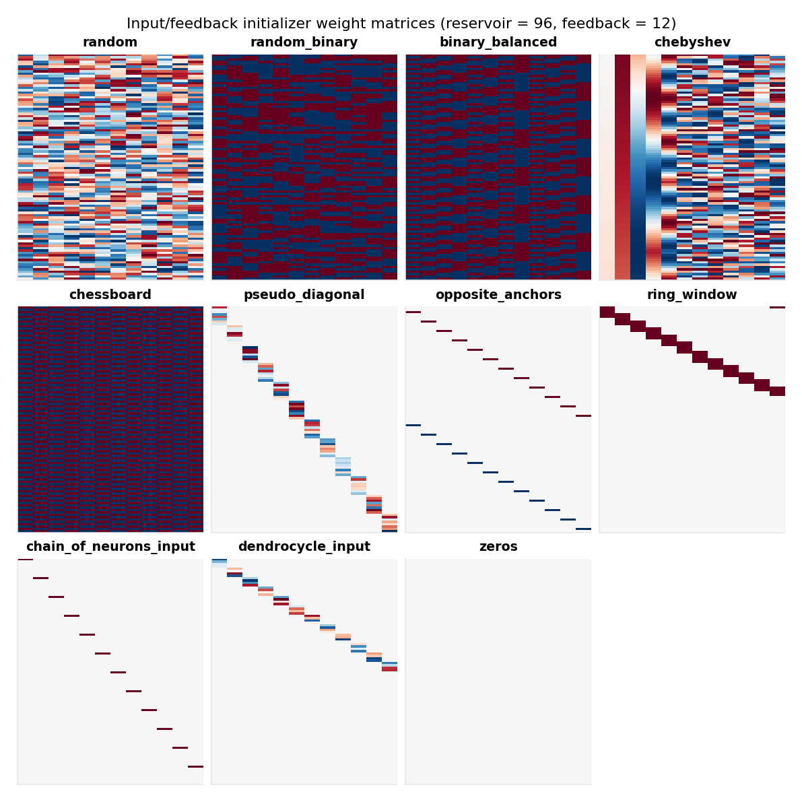

# Input & feedback initializers

The *input* and *feedback* weights — the matrices that map exogenous
signals and autoregressive feedback into the reservoir — have nearly as
much influence on a model as the recurrent matrix itself. ResDAG
exposes **11 initializers** in a registry, ranging from i.i.d. random
to structured deterministic patterns. They use the same three-way
specification (`str | (str, dict) | object`) as
[topologies](topologies.md).

## The whole zoo at a glance

Each panel below shows the actual weight matrix produced by the
initializer for a 96-unit reservoir with 12 feedback channels. Red is
positive, blue is negative, neutral is grey/white:

<figure markdown>
  { width="900" }
  <figcaption>Every registered input/feedback initializer at
  reservoir = 96, feedback = 12. Re-generate with
  <code>.venv/bin/python -m scripts.docs_figures.initializers</code>.</figcaption>
</figure>

A quick taxonomy:

| Family | Initializers | What's distinctive |
|---|---|---|
| Random | `random`, `random_binary`, `binary_balanced` | i.i.d. weights drawn from a distribution. The robust default. |
| Deterministic chaotic | `chebyshev` | Weights come from Chebyshev-map dynamics; structured but high-rank. |
| Block / pattern | `chessboard`, `pseudo_diagonal` | Geometric patterns useful as ablations or in research. |
| Sparse structured | `opposite_anchors`, `ring_window`, `chain_of_neurons_input`, `dendrocycle_input` | One or a few non-zeros per channel; the input touches the reservoir at specific anchor points. |
| Sentinels | `zeros` | No connections. Use to confirm a system genuinely needs feedback. |

## Plugging an initializer into a model

```python
from resdag import classic_esn
from resdag.init.input_feedback import get_input_feedback

# 1. Bare name
model = classic_esn(400, feedback_size=3, output_size=3,
                    feedback_initializer="chebyshev")

# 2. Name + parameter overrides
model = classic_esn(400, feedback_size=3, output_size=3,
                    feedback_initializer=("chebyshev", {"input_scaling": 0.5}))

# 3. Pre-built InputFeedbackInitializer object
init = get_input_feedback("chebyshev", k=3.6, input_scaling=0.5)
model = classic_esn(400, feedback_size=3, output_size=3,
                    feedback_initializer=init)
```

The same applies to `input_initializer` (used by `ESNLayer` when
`input_size` is set — driving inputs distinct from feedback).

## Discovering what's available

```python
from resdag.init.input_feedback import show_input_initializers

show_input_initializers()                # list every registered name
show_input_initializers("chebyshev")     # parameter table for one initializer
```

## When the choice matters

For most tasks the random initializers (`random`, `random_binary`) are
fine. The structured ones become interesting when:

- **The reservoir has structure** that the initializer should
  respect — `ring_window` and `dendrocycle_input` are designed to feed
  inputs into specific regions of structured-topology reservoirs.
- **You want reproducibility without `manual_seed`** — `chebyshev`
  produces structured, near-orthogonal weights from a deterministic
  recurrence, so two builds with the same parameters give the same
  matrix without touching the global RNG.
- **You want extreme sparsity in the input map** — `chain_of_neurons_input`
  or `opposite_anchors` connect each input channel to just a single (or
  a handful of) reservoir units.

## Registering a custom initializer

Subclass `InputFeedbackInitializer`, implement `initialize(weight,
**kwargs)`, and decorate the class with `@register_input_feedback`. The
registered initializer is then available everywhere by name.

```python
import torch
from resdag.init.input_feedback import (
    InputFeedbackInitializer, register_input_feedback,
)

@register_input_feedback("orthogonal", gain=1.0)
class OrthogonalInputInitializer(InputFeedbackInitializer):
    """Random orthonormal columns scaled by ``gain``."""

    def __init__(self, gain: float = 1.0) -> None:
        self.gain = gain

    def initialize(self, weight: torch.Tensor, **kwargs) -> torch.Tensor:
        torch.nn.init.orthogonal_(weight, gain=self.gain)
        return weight
```

After import, use it like any built-in:

```python
model = classic_esn(
    400, feedback_size=3, output_size=3,
    feedback_initializer=("orthogonal", {"gain": 0.8}),
)
```

A complete worked end-to-end example, including a head-to-head
comparison against the random baseline, is in the
[custom initializer example](../examples/custom-initializer.md). See the
[extending guide](../extending/custom-initializer.md) for the full
registration rules and the
[InputFeedbackInitializer reference](../reference/init/input-feedback.md).

## Things to remember

- **Scaling matters.** `input_scaling` is a multiplicative knob on top
  of whatever the initializer produced. Most chaotic-system bugs trace
  back to feedback weights that were too large (saturating `tanh`) or
  too small (input invisible to the reservoir).
- **`zeros` exists for a reason.** Set the feedback initializer to
  `zeros` and confirm the model can't forecast — proves your reservoir
  is actually using the feedback signal.
- **Trainable initializers**: passing `trainable=True` to `ESNLayer`
  makes the input/feedback matrices learnable parameters. The
  initializer is then just the starting point and the matrices evolve
  under gradient descent.
