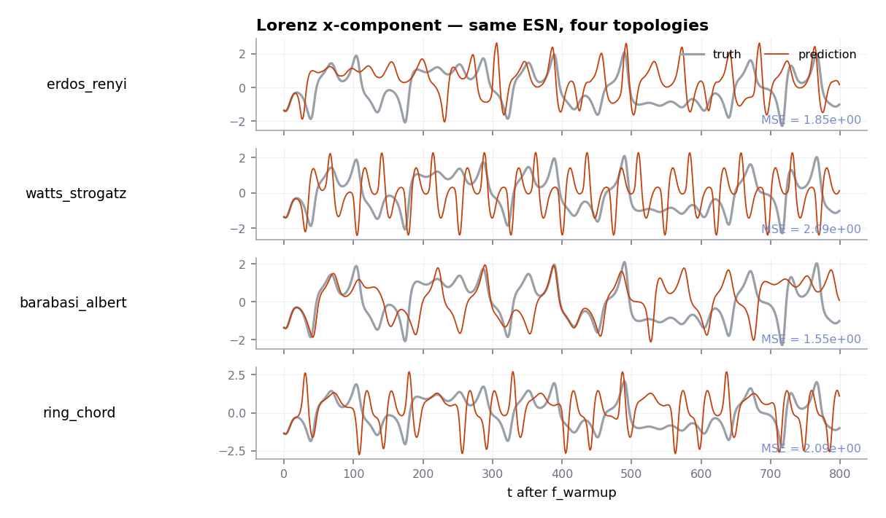

# Graph topologies

The recurrent weight matrix of a reservoir doesn't have to be a dense
i.i.d. Gaussian. ResDAG ships **17 graph topologies** in a registry —
small-world, scale-free, ring-based, dendrocycle, and a few others —
all selectable by name, all plug-compatible with every premade factory
and with the [functional API](functional-api.md). You can also register
your own with a single decorator.

## The whole zoo at a glance

Each panel is the adjacency matrix of a 100-unit reservoir built with
the topology and its default parameters, after spectral-radius scaling
to 0.9:

<figure markdown>
  { width="900" }
  <figcaption>Every registered topology, rendered as a connectivity
  matrix. Re-generate with
  <code>.venv/bin/python -m scripts.docs_figures.topologies</code>.</figcaption>
</figure>

A quick taxonomy:

| Family | Topologies | What's distinctive |
|---|---|---|
| Random | `erdos_renyi`, `connected_erdos_renyi`, `random` | Uniformly distributed edges. Robust default. |
| Small-world | `watts_strogatz`, `newman_watts_strogatz`, `connected_watts_strogatz`, `kleinberg_small_world` | Local-cluster ring + a few long-range shortcuts. |
| Scale-free | `barabasi_albert` | Preferential-attachment power-law degree distribution. |
| Structured | `regular`, `complete`, `ring_chord`, `simple_cycle_jumps`, `multi_cycle` | Deterministic patterns; useful for ablation studies. |
| Hierarchical | `dendrocycle`, `chord_dendrocycle`, `spectral_cascade` | Core cycle + dendritic / cascading sub-structures. |
| Sentinels | `zeros` | No edges. Useful as a control to confirm the readout alone can't solve the task. |

## Plugging a topology into a model

Three equivalent ways to specify a topology — pick the one that fits the
context:

```python
from resdag import classic_esn
from resdag.init.topology import get_topology

# 1. Bare name (uses registry defaults)
model = classic_esn(400, feedback_size=3, output_size=3,
                    topology="watts_strogatz")

# 2. Name + parameter overrides
model = classic_esn(400, feedback_size=3, output_size=3,
                    topology=("watts_strogatz", {"k": 8, "p": 0.3}))

# 3. Pre-built TopologyInitializer object
topo = get_topology("watts_strogatz", k=8, p=0.3, seed=42)
model = classic_esn(400, feedback_size=3, output_size=3, topology=topo)
```

The same three forms work for every factory and for `ESNLayer` directly.

## Discovering what's available

```python
from resdag.init.topology import show_topologies

show_topologies()                 # list every registered name
show_topologies("watts_strogatz") # parameter table for one topology
```

`show_topologies()` returns the list of names too, so you can drive
selection programmatically (e.g. in an HPO `search_space`).

## Does the choice actually matter?

For most tasks the *fact* that the recurrent weights are well-scaled
matters more than the specific topology — but the difference between
families becomes meaningful for chaotic forecasting. Below is the same
Ott ESN trained on Lorenz-63, with only the topology changed:

<figure markdown>
  { width="780" }
  <figcaption>Lorenz-63 x-component forecast over 800 steps, identical
  hyperparameters apart from the topology. Truth in grey,
  prediction in amber. The MSE is reported per panel.</figcaption>
</figure>

The take-home: small-world and scale-free topologies often outperform
plain Erdős–Rényi on chaotic dynamics, but the gain is highly
seed-sensitive. Always sweep topology *and* spectral radius
together — see the [HPO guide](hyperparameter-optimization.md).

## Registering a custom topology

A topology is a function that takes the number of nodes and returns a
weighted NetworkX graph. Decorate it with `@register_graph_topology` and
it becomes selectable by name everywhere in the library — including
HPO, `show_topologies()`, and the resolver in `ESNLayer`.

```python
import networkx as nx
import numpy as np
from resdag.init.topology import register_graph_topology

@register_graph_topology("two_block", density_in=0.3, density_out=0.05, seed=None)
def two_block_graph(n, density_in=0.3, density_out=0.05, seed=None):
    """Two equal-size blocks, dense within each, sparse between."""
    rng = np.random.default_rng(seed)
    G = nx.DiGraph()
    G.add_nodes_from(range(n))
    half = n // 2
    for u in range(n):
        for v in range(n):
            if u == v:
                continue
            same_block = (u < half) == (v < half)
            p = density_in if same_block else density_out
            if rng.random() < p:
                G.add_edge(u, v, weight=rng.choice([-1.0, 1.0]))
    return G
```

After import, this is callable like any built-in topology:

```python
from resdag import classic_esn

model = classic_esn(
    400, feedback_size=3, output_size=3,
    topology=("two_block", {"density_in": 0.25, "density_out": 0.02}),
)
```

See the [custom topology guide](../extending/custom-topology.md) for the
full registration rules and the
[topology base classes](../reference/init/topology.md) for the API.

## Things to remember

- **Spectral radius scaling happens after the graph is built.** The
  topology controls *which* weights exist; spectral radius controls
  *how big* they are.
- **Different topologies behave differently under spectral-radius
  scaling.** A spectral radius of 1.0 in a sparse Erdős–Rényi graph
  produces very different dynamics than a spectral radius of 1.0 in a
  scale-free Barabási–Albert graph. Re-tune when you switch.
- **`zeros` is your sanity check.** If a forecast still looks
  reasonable with `topology="zeros"`, the readout is doing too much of
  the work and the reservoir isn't contributing.
