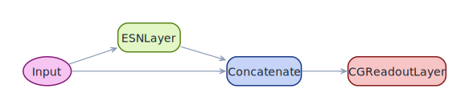
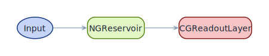

# Visualizing architectures

Every `ESNModel` exposes two introspection methods:

- `model.summary()` — a text table of every node, parameter count, and
  output shape, printed to the terminal.
- `model.plot_model()` — a graphviz-rendered DAG (SVG/PNG/PDF), shown
  inline in Jupyter or written to disk in a script.

```python
from resdag import ott_esn

model = ott_esn(reservoir_size=300, feedback_size=3, output_size=3)
model.summary()
model.plot_model(save_path="ott_esn_arch.svg", format="svg")
```

What follows is a gallery: every diagram on this page is the literal
output of `model.plot_model()` on the matching factory or functional-API
build. The progression goes **simple → complex** to illustrate the kinds
of architectures ResDAG can express.

---

## 1. Minimal — one reservoir, one readout

The smallest useful ResDAG model. A single `ESNLayer` feeds a single
`CGReadoutLayer`. No augmentation, no skip connection, no second
branch.

<figure markdown>
  { width="520" }
</figure>

```python
from resdag import ESNModel, reservoir_input
from resdag.layers import ESNLayer, CGReadoutLayer

inp = reservoir_input(1)
res = ESNLayer(reservoir_size=100, feedback_size=1)(inp)
out = CGReadoutLayer(100, 1, name="output")(res)
model = ESNModel(inp, out)
```

---

## 2. Classic ESN — input bypasses the reservoir

The textbook architecture. The raw input is concatenated with the
reservoir state before the readout, so the readout sees both.

<figure markdown>
  { width="720" }
</figure>

```python
from resdag import classic_esn
model = classic_esn(reservoir_size=300, feedback_size=3, output_size=3)
```

---

## 3. Ott ESN — augmented state

Ott's chaotic-forecasting architecture augments the reservoir state by
squaring its even-indexed units before concatenation.

<figure markdown>
  { width="720" }
</figure>

```python
from resdag import ott_esn
model = ott_esn(reservoir_size=300, feedback_size=3, output_size=3)
```

---

## 4. Input-driven — feedback plus an exogenous driver

The first input is the feedback channel; the second is a driver that
rides alongside. The reservoir layer takes both as positional inputs.

<figure markdown>
  { width="720" }
</figure>

```python
feedback = reservoir_input(3)
driver   = reservoir_input(2)
res = ESNLayer(300, feedback_size=3, input_size=2)(feedback, driver)
out = CGReadoutLayer(300, 3, name="output")(res)
model = ESNModel([feedback, driver], out)
```

---

## 5. Multi-readout — one reservoir, several heads

A shared reservoir feeds two readouts. `ESNTrainer.fit` trains both at
once; each readout's `name` matches the key passed in `targets={…}`.

<figure markdown>
  { width="720" }
</figure>

```python
inp = reservoir_input(3)
res = ESNLayer(400, feedback_size=3)(inp)
head_pos = CGReadoutLayer(400, 3, name="position")(res)
head_vel = CGReadoutLayer(400, 3, name="velocity")(res)
model = ESNModel(inp, [head_pos, head_vel])
```

---

## 6. Parallel reservoirs — multi-timescale dynamics

Two reservoirs with different time constants (`leak_rate`,
`spectral_radius`) run in parallel; their outputs concatenate before the
readout. The readout learns to combine fast and slow features.

<figure markdown>
  { width="720" }
</figure>

```python
from resdag.layers import Concatenate

inp = reservoir_input(3)
fast = ESNLayer(200, feedback_size=3, spectral_radius=0.6, leak_rate=1.0)(inp)
slow = ESNLayer(200, feedback_size=3, spectral_radius=0.95, leak_rate=0.3)(inp)
merged = Concatenate()(fast, slow)
out = CGReadoutLayer(400, 3, name="output")(merged)
model = ESNModel(inp, out)
```

---

## 7. Augmented deep — stacked nonlinear features

The richest pattern: the readout sees four streams — raw input,
reservoir state, all units squared, odd units cubed — concatenated. The
factory `power_augmented` is a one-knob distillation of this idea.

<figure markdown>
  { width="720" }
</figure>

```python
from resdag.layers import Power, SelectiveExponentiation

inp = reservoir_input(3)
res = ESNLayer(400, feedback_size=3)(inp)
square_all = Power(exponent=2.0)(res)
cube_odd   = SelectiveExponentiation(index=1, exponent=3.0)(res)
merged     = Concatenate()(inp, res, square_all, cube_odd)
out = CGReadoutLayer(merged.shape[-1], 3, name="output")(merged)
model = ESNModel(inp, out)
```

---

## 8. NG-RC — no recurrent weights at all

For comparison, a Next-Generation Reservoir Computer is a single
feature-construction layer (delay embedding + polynomial monomials)
straight into a readout. No reservoir matrix, no Echo State Property.

<figure markdown>
  { width="540" }
</figure>

```python
from resdag.layers import NGReservoir

inp = reservoir_input(3)
ngrc = NGReservoir(input_dim=3, k=2, s=1, p=2)
feat = ngrc(inp)
out = CGReadoutLayer(ngrc.feature_dim, 3, name="output")(feat)
model = ESNModel(inp, out)
```

---

## What `plot_model` lets you tweak

```python
model.plot_model(
    show_shapes=True,      # add output shape on each node
    show_trainable=True,   # 🔒 / 🔓 indicator for frozen vs trainable
    rankdir="LR",          # "TB", "LR", "BT", "RL"
    save_path="out.svg",   # write to disk instead of opening a viewer
    format="svg",          # "svg", "png", "pdf"
)
```

`show_trainable=True` is especially useful when you wire ESN models
into larger PyTorch pipelines and want to see at a glance which parts
participate in backprop. See the
[pipeline integration example](../examples/pipeline-integration.md).
