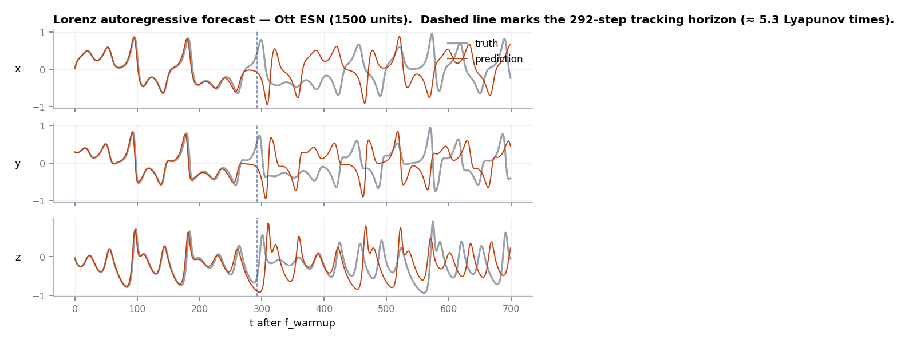

<div class="rd-hero" markdown>

<span class="rd-eyebrow">Reservoir computing · PyTorch-native</span>

# Build reservoir networks<br><span class="rd-gradient">like you build Keras models</span>

<p class="rd-tagline">
ResDAG turns Echo State Networks and Next-Generation Reservoir Computers
into composable PyTorch layers. Wire them into arbitrary DAGs with a
functional API, fit readouts algebraically in a single pass — no epochs —
and drop the trained model into any PyTorch pipeline, optimizer included.
</p>

<ul class="rd-pills">
<li>PyTorch ≥ 2.10</li>
<li>GPU-accelerated</li>
<li>17 graph topologies</li>
<li>One-pass training</li>
<li>Optuna HPO</li>
<li>MIT</li>
</ul>

[Forecast in sixty seconds](learn/quickstart.md){ .md-button .md-button--primary }
[Start the course](learn/index.md){ .md-button }
[Reference](reference/index.md){ .md-button }

</div>

---

## Chaos, forecast, eleven lines

A 500-neuron reservoir learning the Lorenz attractor — built, trained, and
forecasting in the time a single SGD epoch takes elsewhere:

<div class="rd-window" data-title="lorenz.py" markdown>

```python
import resdag as rd

data = rd.utils.load_file("lorenz.npy")          # (1, time, 3)
warmup, train, target, f_warmup, val = rd.utils.prepare_esn_data(
    data, warmup_steps=200, train_steps=5000, val_steps=2000
)

model = rd.models.ott_esn(reservoir_size=500, feedback_size=3, output_size=3)
rd.ESNTrainer(model).fit((warmup,), (train,), targets={"output": target})

prediction = model.forecast(f_warmup, horizon=2000)   # autoregressive
```

</div>

<figure markdown>

<figcaption>Trained in one pass — ridge regression on reservoir states, no
backprop, no epochs. Divergence after several Lyapunov times is the chaos,
not the model.</figcaption>
</figure>

---

## Why ResDAG

<div class="grid cards" markdown>

- :material-graph-outline: **DAGs, not pipelines**

    ---

    Reservoirs, readouts, and transforms are symbolic building blocks —
    call them on tensors like the Keras functional API. Parallel
    reservoirs, multiple readouts, state augmentation: if you can draw it,
    you can wire it.

    [:octicons-arrow-right-24: Building models](learn/building-models.md)

- :material-flash-outline: **One-pass training**

    ---

    Readouts are fitted by conjugate-gradient ridge regression during a
    single forward pass — hooks fit each readout exactly when it executes,
    so multi-readout DAGs train in topological order for free.

    [:octicons-arrow-right-24: Training](learn/training.md)

- :material-puzzle-outline: **A real `nn.Module`**

    ---

    Trained reservoirs move with `.to(device)`, save with `state_dict()`,
    and embed in larger networks. Freeze them as feature extractors, or
    flip `trainable=True` and hand everything to Adam.

    [:octicons-arrow-right-24: PyTorch pipelines](cookbook/pipelines.md)

- :material-shape-plus: **Structure is a function**

    ---

    Seventeen graph topologies and eleven input initializers ship in the
    registry — and any function that builds a matrix plugs in directly:
    `ESNLayer(topology=my_fn)`. Even `torch.nn.init.*` works.

    [:octicons-arrow-right-24: Topologies](cookbook/topologies.md)

- :material-sine-wave: **Built for dynamics**

    ---

    Two-phase forecasting (teacher-forced warmup → autoregression),
    exogenous drivers with pinned time alignment, coupled ensembles, and
    chaos-aware HPO losses like Expected Forecast Horizon.

    [:octicons-arrow-right-24: Forecasting](learn/forecasting.md)

- :material-function-variant: **Math you can audit**

    ---

    Every equation the code implements — the leaky-ESN update, the ridge
    solve, the timing conventions — is written down, index by index, with
    pointers to the classes that implement it.

    [:octicons-arrow-right-24: Under the hood](under-the-hood/index.md)

</div>

---

## Install

```bash
pip install resdag            # core
pip install "resdag[hpo]"     # + Optuna hyperparameter optimization
```

Python ≥ 3.11, PyTorch ≥ 2.10. GPU optional but encouraged.

---

## Choose your track

<div class="grid cards" markdown>

- **New to reservoir computing?**

    ---

    Start with [why reservoirs work](learn/reservoir-computing.md) — five
    minutes, no equations — then follow the course in order.

- **Know ESNs, new to ResDAG?**

    ---

    The [quickstart](learn/quickstart.md) and
    [anatomy](learn/anatomy.md) pages map your mental model onto the API
    in two short reads.

- **Migrating research code?**

    ---

    [Under the hood](under-the-hood/index.md) pins down every convention —
    index origins, shift directions, what gets centered — so you can
    validate against your own derivations.

- **Just need a recipe?**

    ---

    The [cookbook](cookbook/index.md) solves one problem per page,
    copy-paste ready: drivers, ensembles, persistence, GPU, HPO.

</div>
