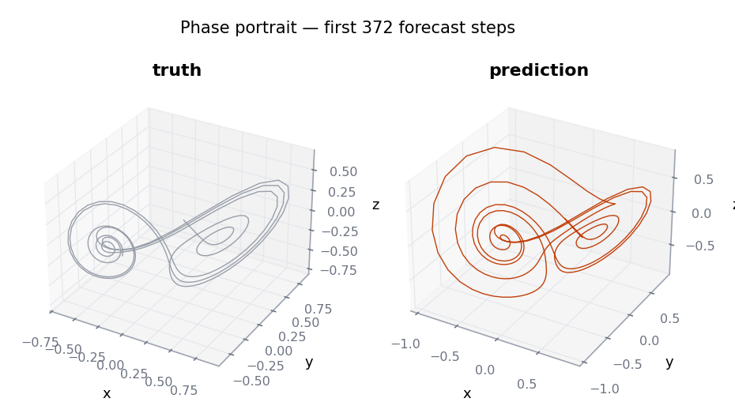

<span class="rd-eyebrow">Learn · 06</span>

# Forecasting

By the end of this page you'll be generating multi-step forecasts with one
call, feeding future driver signals correctly, and judging the result in
Lyapunov times instead of wishful thinking.

## Two phases, one call

```python
prediction = model.forecast(f_warmup, horizon=500)
# (batch, 500, features)
```

**Phase 1 — warmup.** Reservoir states are reset (default `reset=True`),
then the model runs teacher-forced over `f_warmup`. This is the echo state
property at work: drive the reservoir long enough and its state depends
only on the recent input history, not on the zeros it started from. Pass
`reset=False` to continue from a state you restored manually.

**Phase 2 — autoregression.** The last warmup output becomes the first
forecast step; from then on, output $t$ is fed back as input $t{+}1$. The
model runs on its own predictions — no ground truth anywhere. The returned
tensor starts at the first step *after* the warmup window, aligned exactly
with the `val` split from `prepare_esn_data`.

The variations:

```python
# Prepend the warmup outputs: (batch, warmup_steps + 500, features)
full = model.forecast(f_warmup, horizon=500, return_warmup=True)

# Override the seed of the autoregression (default: last warmup output)
pred = model.forecast(f_warmup, horizon=500,
                      initial_feedback=start)   # (batch, 1, feedback_dim)
```

For multi-output models `forecast` returns a tuple of tensors, and the
**first** output is the one fed back — its dimension must equal the
feedback input's, or `forecast` raises before generating anything.

## Driver-driven forecasting

The model can't invent its own future driver values — you supply them
through `forecast_inputs`. The convention: the forecast drivers start
**right after the warmup window** and cover `horizon - 1` steps (or
`horizon`; the last step is then unused).

<div class="rd-window" data-title="forecast_driven.py" markdown>

```python
T, horizon = 200, 500

# fb: full feedback series, d: full driver series, aligned in time
prediction = model.forecast(
    (fb[:, :T], d[:, :T]),                        # warmup window
    forecast_inputs=(d[:, T : T + horizon - 1],), # drivers AFTER warmup
    horizon=horizon,
)
```

</div>

Why `horizon - 1`: forecast step 0 is produced *during* warmup, from the
last warmup feedback/driver pair. The autoregressive loop only generates
steps 1 through `horizon - 1`, each pairing the previous prediction with
the driver at that same timestep. Slicing `d[:, T : T + horizon]` also
works — the final step is ignored, which is convenient when you cut drivers
over the same window as your validation targets. The full index-by-index
walkthrough is in
[timing and alignment](../under-the-hood/timing-and-alignment.md).

## How far can you forecast?

For chaotic systems, the honest unit is the **Lyapunov time** — the time
for nearby trajectories to diverge by a factor of $e$. Any error, even
float rounding, grows roughly as $e^{\lambda t}$, so no model forecasts
chaos indefinitely. A well-tuned ESN tracks Lorenz-63 for several Lyapunov
times; a great one buys you one or two more, never twenty.

<figure markdown>

<figcaption>Autoregressive forecast (amber) against held-out truth (grey).
The model tracks for hundreds of steps before phase drift takes
over.</figcaption>
</figure>

Divergence is not failure, and what happens after matters just as much. A
good model loses the *phase* of the trajectory but keeps producing states
on the attractor — its long-run behavior remains statistically right, like
a climate model that can't tell you next Tuesday's weather:

<figure markdown>

<figcaption>The forecast's phase portrait stays on the butterfly long after
the trajectories have separated.</figcaption>
</figure>

!!! tip "Stretching the horizon"
    The biggest single upgrade is averaging: coupled ensembles of
    independently initialized models routinely add Lyapunov times over any
    single member. See the
    [ensembles recipe](../cookbook/ensembles.md).

## Next

[**07 · Tuning**](tuning.md) — the knob panel, what each one does to the
dynamics, and automated search with Optuna.
