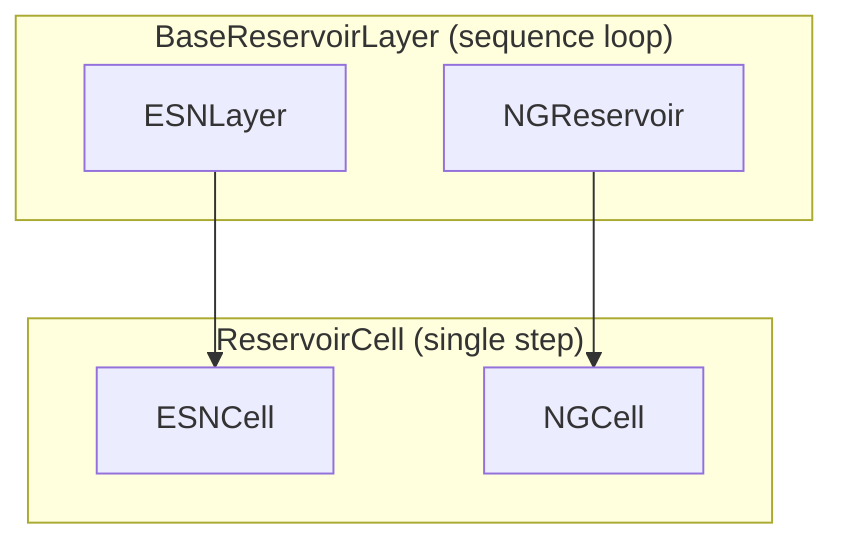

# Reservoir layers

!!! info "Why this exists"
    Reservoir code paths are split into **cells** (one timestep) and **layers** (full
    sequences + state API). That separation keeps `ESNCell` weight logic small while
    `ESNLayer` handles batching, device placement, and `reset_state()` / `get_state()`.

## Architecture



| Type | Class | Role |
|------|-------|------|
| Cell | `ReservoirCell` | Abstract `forward(x, state) → (output, new_state)` |
| Cell | `ESNCell` | Leaky ESN update; owns $W_{\mathrm{res}}, W_{\mathrm{in}}, W_{\mathrm{fb}}$ |
| Cell | `NGCell` | Delay buffer + polynomial features; **no** learnable weights |
| Layer | `BaseReservoirLayer` | Iterates over time; stores `self.state` |
| Layer | `ESNLayer` | Public ESN RNN |
| Layer | `NGReservoir` | Public NG-RC wrapper |

`BaseReservoirLayer.forward` accepts `(batch, timesteps, features)` feedback plus optional
driving inputs, loops $t = 1 \ldots T$, and returns `(batch, timesteps, output_size)`.

## Stateful API

Reservoirs remember state between calls:

```python
reservoir.reset_state()                    # lazy re-init on next forward
reservoir.reset_state(batch_size=8)        # zeros, explicit batch
reservoir.set_random_state()               # uniform [-1, 1]
h = reservoir.get_state()                  # clone or None
```

`ESNLayer` delegates attribute access to its inner `ESNCell` (`reservoir.reservoir_size`,
`reservoir.weight_hh`, …).

## Minimal ESN forward

```python
import torch
from resdag.layers import ESNLayer

layer = ESNLayer(200, feedback_size=1, topology="erdos_renyi")
u = torch.randn(4, 50, 1)   # batch, time, feedback
states = layer(u)           # (4, 50, 200)
```

## NG-RC difference

`NGReservoir` uses the same layer base class but `NGCell` state is a **delay buffer**
(shape `(batch, (k-1)*s, input_dim)`), not a recurrent hidden vector. See
[Next-Generation RC](ngrc.md).

## See also

- [Reference: reservoirs](../reference/layers/reservoirs.md)
- [Reference: cells](../reference/layers/cells.md)
- [Extend: custom cell](../extending/custom-cell.md)
