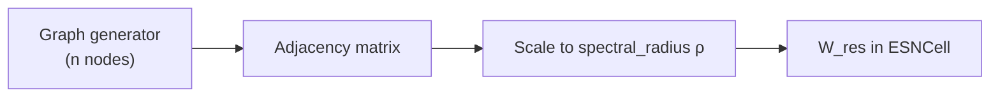

# Graph topologies

!!! info "Why this exists"
    Random dense $W_{\mathrm{res}}$ works, but **structure** (cycles, hubs, small-world
    wiring) changes memory, eigenvalue spectrum, and task performance. ResDAG builds
    recurrent weights from **NetworkX graphs**, scales them to a target spectral radius,
    and exposes 17 named generators through one registry.

## Pipeline



1. Pick a topology name (or custom `@register_graph_topology` function).
2. `GraphTopology` calls `graph_func(n, **params)` → weighted `nx.Graph` / `DiGraph`.
3. Weights are copied to `weight_hh` and rescaled so $\rho(W_{\mathrm{res}}) \approx$
   `spectral_radius`.

## Specifying topology in code

```python
# String — registry defaults
ESNLayer(200, feedback_size=3, topology="erdos_renyi")

# Tuple — override parameters
ESNLayer(200, feedback_size=3, topology=("watts_strogatz", {"k": 6, "p": 0.2}))

# Pre-built object
from resdag.init.topology import get_topology
topo = get_topology("barabasi_albert", m=3, seed=42)
ESNLayer(200, feedback_size=3, topology=topo)
```

Discover names and defaults:

```python
from resdag.init.topology import show_topologies
print(show_topologies())           # list all
print(show_topologies("erdos_renyi"))  # parameter table
```

## Registered topologies (17)

| Name | One-line description |
|------|----------------------|
| `erdos_renyi` | Random edges with probability `p` |
| `connected_erdos_renyi` | ER with connectivity retries |
| `watts_strogatz` | Ring + local rewiring (`k`, `p`) |
| `connected_watts_strogatz` | WS with connectivity wrapper |
| `newman_watts_strogatz` | Newman–Watts (add edges, no rewiring) |
| `barabasi_albert` | Preferential attachment (`m`) |
| `complete` | All-to-all |
| `regular` | Each node degree `k` |
| `random` | Uniform weights on random support |
| `ring_chord` | Ring with chord shortcuts |
| `multi_cycle` | Multiple cyclic components |
| `simple_cycle_jumps` | Cycle with jump edges |
| `dendrocycle` | Tree-like cycle structure |
| `chord_dendrocycle` | Dendrocycle + chords |
| `kleinberg_small_world` | Kleinberg small-world grid |
| `spectral_cascade` | Spectral scaling cascade |
| `zeros` | Zero matrix (ablation / debugging) |

Parameter defaults for any row: `show_topologies("name")` or
[Graph generators reference](../reference/init/graphs.md).

## See also

- [Echo State Property](echo-state-property.md)
- [Reference: topology](../reference/init/topology.md)
- [Extend: custom topology](../extending/custom-topology.md)
