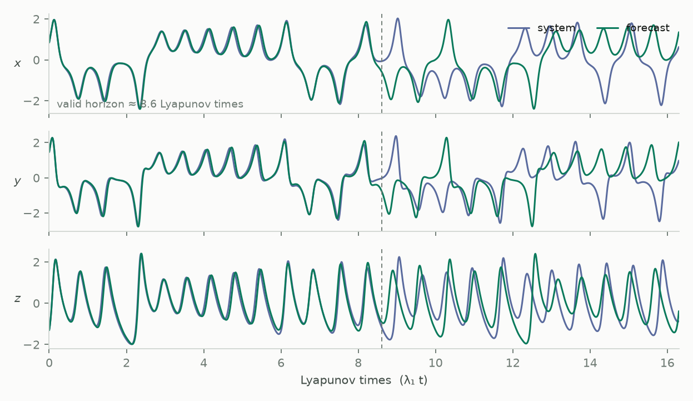

<span class="nb-kicker">Start · 02</span>

# First forecast

The script below trains a 900-neuron reservoir on five thousand samples of
the Lorenz attractor, then forecasts two thousand steps autoregressively,
feeding each prediction back as the next input. Training is a single
algebraic solve; there is no gradient-descent loop.

<div class="nb-specimen" data-label="first_forecast.py" markdown>

```python
import torch
import resdag as rd

# --- A chaotic system to learn: Lorenz-63, integrated with Euler steps ---
def lorenz(n, dt=0.01):
    xyz = torch.tensor([1.0, 1.0, 25.0])
    out = torch.empty(n, 3)
    for i in range(n):
        x, y, z = xyz
        xyz = xyz + dt * torch.tensor([10 * (y - x), x * (28 - z) - y, x * y - 8 / 3 * z])
        out[i] = xyz
    return out.unsqueeze(0)                    # (batch=1, time, 3)

data = lorenz(7500)
data = (data - data.mean(1, keepdim=True)) / data.std(1, keepdim=True)

# --- Split the timeline into warmup / train / validation segments ---
warmup, train, target, f_warmup, val = rd.utils.prepare_esn_data(
    data, warmup_steps=300, train_steps=5000, val_steps=2000
)

# --- Build, train, forecast ---
model = rd.models.ott_esn(reservoir_size=900, feedback_size=3, output_size=3)

rd.ESNTrainer(model).fit(
    warmup_inputs=(warmup,),
    train_inputs=(train,),
    targets={"output": target},
)

prediction = model.forecast(f_warmup, horizon=2000)    # (1, 2000, 3)
```

</div>

<figure markdown>

<figcaption>All three Lorenz components, true system against autonomous ESN
forecast. The dashed line marks the valid horizon — about 8–9 Lyapunov
times here, from the same 900-unit model after a small grid search over
spectral radius and ridge alpha. Divergence past that point reflects the
chaotic sensitivity of the system, not a defect in the model.</figcaption>
</figure>

---

## What each block did

**The split.** `prepare_esn_data` cuts one timeline into everything the
workflow needs:

```text
[ warmup │ train ────────────────────── │ val ]
                          └─ f_warmup ─┘
```

`target` is `train` shifted forward one step — the model learns *given the
signal now, emit the signal one step ahead*. `f_warmup` is the tail of
`train`, used to re-synchronize the reservoir immediately before the
held-out window. Normalization is important: the tanh activation saturates
when inputs are far from order one.

**The model.** `ott_esn` wires the architecture Pathak et al. used for
chaotic systems: a frozen random reservoir, a quadratic state augmentation,
and a ridge-regression readout named `"output"`. The reservoir weights stay
fixed; training changes only the readout's linear map.

**The fit.** One teacher-forced pass over `warmup` synchronizes the state;
one pass over `train` collects states and solves the ridge problem against
`target` by conjugate gradient. The `"output"` key in `targets` matches the
readout's `name` parameter; this is how target tensors are routed to
readout layers.

**The forecast.** Two phases: teacher-forced warmup on `f_warmup`, then
`horizon` autoregressive steps where each output becomes the next input.
The returned tensor aligns one-to-one with `val`, so the forecast error can
be computed directly.

!!! note "If the forecast diverges early"
    Adjust `spectral_radius` (0.8–1.2) and the readout's `alpha`
    (log-scale, 1e-8–1e-2) first. The full set of tuning parameters is
    covered in [Tune](../workflows/tune.md).

## Next

[**03 · The mental model**](concepts.md) — the four ideas everything else
builds on.
