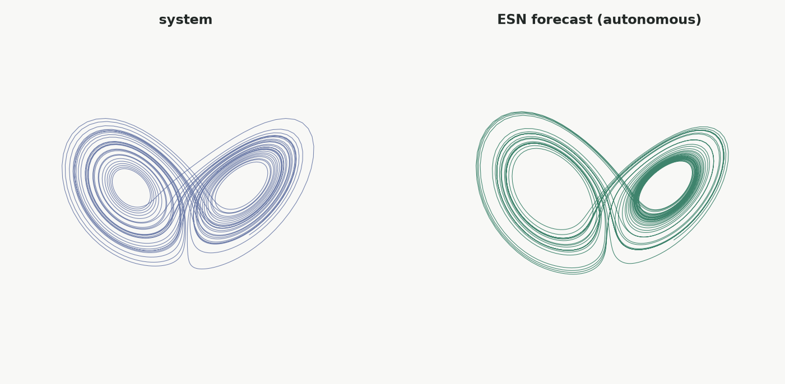

<span class="nb-kicker">Work · Forecast</span>

# Forecast

`forecast()` runs two phases: a teacher-forced warmup that synchronizes
the reservoir on real data, then `horizon` steps in which each output
becomes the next feedback input. The rest of this page covers the
indexing and alignment around that loop, which is where most forecast
errors originate.

## Anatomy

```python
preds = model.forecast(f_warmup, horizon=2000)     # (batch, 2000, features)
```

Phase 1 resets the reservoirs (pass `reset=False` to continue from a
saved state instead), runs a teacher-forced pass over `f_warmup`, and
keeps the outputs. Prediction 0 *is* the last warmup output — the model's
one-step prediction from the final real sample — so phase 2 makes
`horizon − 1` model calls, each feeding the previous output back in. The
returned tensor aligns one-to-one with the `val` split from
`prepare_esn_data`, so error metrics can be computed element-wise with
no further index arithmetic.

Two optional arguments:

```python
full = model.forecast(f_warmup, horizon=2000, return_warmup=True)
# (batch, warmup_steps + 2000, features) — teacher-forced outputs prepended;
# useful for plotting the handover from teacher forcing to autoregression

preds = model.forecast(f_warmup, horizon=2000, initial_feedback=seed)
# seed: (batch, 1, feedback_dim) — replaces the last warmup output as the
# first autoregressive input
```

**Multi-output models** return a tuple with the same structure. The
*first* output is the one fed back, so its dimension must equal the
feedback input's — a mismatch raises immediately, listing the model's
readouts. The remaining outputs are computed at each step but do not
enter the loop.

---

## Driver alignment

Training pairs `(feedback_t, driver_t) → feedback_{t+1}`. The forecast
loop keeps that pairing, which pins where the forecast drivers must start
and how many steps you need:

```text
warmup window    [0 .......... T)      feedback and drivers, teacher-forced
forecast window  [T ... T + horizon)   feedback generated by the model,
                                       drivers supplied by you
```

Forecast drivers start at `T` — the first step *after* the warmup window,
exactly where the warmup drivers ended — and `horizon − 1` steps are
consumed, because the step-`T` prediction was already produced during
warmup from the last warmup pair. Slicing both windows from one full
driver series `d`:

<div class="nb-specimen" data-label="driven_forecast.py" markdown>

```python
T, horizon = 200, 300

preds = model.forecast(
    (x[:, :T], d[:, :T]),                          # warmup: feedback + driver
    forecast_inputs=(d[:, T : T + horizon - 1],),  # drivers continue at T
    horizon=horizon,
)
truth = x[:, T : T + horizon]                       # preds align with this
```

</div>

Passing `horizon` steps instead of `horizon − 1` is also accepted — the
last one is unused — so you may slice drivers over the same window as
your validation targets. Any other length raises. The validator is strict
because misaligned drivers fail silently: shifted by one step, the model
trains without error and only the forecast quality degrades.
[Theory · Timing](../theory/timing.md) derives the alignment index by
index.

---

## Windowed reconstruction

`windowed_forecast()` fills the gaps in a sparsely-observed trajectory.
You hold the *full* ground-truth series but only trust it in periodic
windows; between them the model free-runs. Each cycle re-synchronizes the
reservoir on a short teacher-forced window, then forecasts across the
unobserved gap — and because the Echo State Property re-anchors the state
on every observed window, per-window error does not compound across
windows, so gaps can be filled indefinitely. It is a thin
`@torch.no_grad()` loop over `forecast()`: the reservoir is reset once (on
the first window, and only when `reset=True`) and its state is carried
across the whole pass.

```text
[== warmup W ==][~~ gap P ~~][= teacher F =][~~ gap P ~~][= F =] ...
   observed        filled        observed       filled       obs
 (teacher-forced) (forecast)  (teacher-forced) (forecast)
```

<div class="nb-specimen" data-label="windowed_forecast.py" markdown>

```python
recon, mask = model.windowed_forecast(
    series,            # (batch, T, feedback_dim) ground truth
    predict_len=200,   # P: autonomous steps per gap
    teacher_len=40,    # F: real steps teacher-forced to re-sync
    warmup_len=200,    # initial sync window (defaults to teacher_len)
    return_mask=True,  # mask[t] True where observed, False where forecast
)
# recon: real values on observed steps, forecasts on the gaps.
# Score the steps the model never saw:
gap_rmse = ((recon[:, ~mask] - series[:, ~mask]) ** 2).mean().sqrt()
```

</div>

The returned `mask` is a 1-D boolean of length `T`: `True` on observed
(teacher-forced) steps and any untouched trailing remainder, `False` on
the forecast gaps. The gaps are *exactly* what you score —
`recon[:, ~mask]` against `series[:, ~mask]` — the values the model had to
infer without ever seeing them. Observed segments are copied verbatim, so
`recon[:, mask]` equals `series[:, mask]`.

For **driven models**, pass one full-timeline driver series per driver
*positionally*; each is sliced per cycle internally (unlike `forecast()`,
which takes separate warmup and forecast driver tuples):

```python
recon = model.windowed_forecast(feedback, driver, predict_len=100, teacher_len=50)
```

Keep `predict_len` short relative to the system's predictability horizon
(a few Lyapunov times for chaotic systems): sparse sampling still rebuilds
the attractor, but phase tracking degrades before the attractor *shape*
does. For multi-output models the first output is fed back, as in
`forecast()`, and only that channel is reconstructed.

---

## Coupled ensembles

A coupled ensemble runs N independently initialized models, trained
separately, in a single forecast loop: at every autoregressive step each
member receives the *same* aggregated output (mean, median, or a custom
module) as its next feedback. The shared signal couples the members and
suppresses any single member's error growth, and the spread between
members provides an uncertainty estimate.

```python
import torch
import resdag as rd

ensemble = rd.coupled_ensemble_esn(
    n_models=5,
    model_factory=rd.classic_esn,   # default: rd.ott_esn
    aggregate="mean",               # "median" | nn.Module: (N, B, T, F) -> (B, T, F)
    seed=42,                        # sub-model i is built under seed + i
    reservoir_size=300, feedback_size=3, output_size=3,
)

ensemble.fit((warmup,), (train,), {"output": target})   # same contract as ESNTrainer
preds = ensemble.forecast(f_warmup, horizon=400)        # (batch, 400, 3)

agg, members = ensemble.forecast(f_warmup, horizon=400, return_individuals=True)
spread = torch.stack(members).std(dim=0)                # (batch, 400, 3)
```

`fit` trains each member independently on the same data — diversity comes
purely from the random initializations (`n_workers > 1` fits members in a
thread pool). If a member diverges mid-forecast, an outlier-filtering
aggregator excludes it from the shared signal:

```python
from resdag.ensemble.aggregators import OutliersFilteredMean

ensemble = rd.coupled_ensemble_esn(
    n_models=10,
    aggregate=OutliersFilteredMean(method="z_score", threshold=2.0),
    reservoir_size=300, feedback_size=3, output_size=3,
)
```

## How far you can forecast

For chaotic systems the ceiling is the system's, not the model's: any
initial error grows like $e^{\lambda t}$, so even a near-perfect one-step
predictor diverges after a few Lyapunov times. A well-tuned ESN tracks
the true trajectory for several Lyapunov times; after that the pointwise
forecast decorrelates, but the trajectory remains on the attractor, so
the forecast stays statistically consistent with the system after it
stops being pointwise accurate.

<figure markdown>

<figcaption>The true Lorenz attractor and the attractor traced by 4,000
autonomous forecast steps. Past the valid horizon the forecast
decorrelates from the true trajectory but continues to reconstruct the
attractor's geometry.</figcaption>
</figure>

If forecasts diverge well before this point, tune the hyperparameters
before increasing reservoir size.

## Next

- [**Tune**](tune.md) — hyperparameter optimization for forecast quality
- [Theory · Timing](../theory/timing.md) — derivation of every index in the forecast loop
